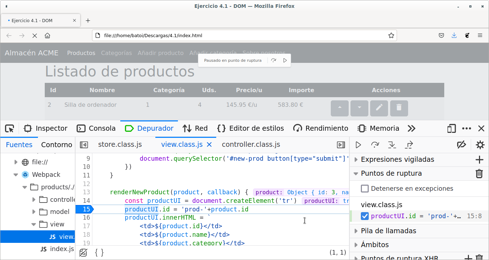

# UD1 - 0. Introducción a Javascript

- [Introducción](#introducción)
  - [Un poco de historia](#un-poco-de-historia)
  - [Soporte en los navegadores](#soporte-en-los-navegadores)
- [Herramientas](#herramientas)
  - [La consola del navegador](#la-consola-del-navegador)
  - [Editores](#editores)
  - [Editores on-line](#editores-on-line)
- [Incluir javascript en una página web](#incluir-javascript-en-una-página-web)
- [Mostrar información](#mostrar-información)
- [git](#git)
- [npm](#npm)

## Introducción

En las páginas web el elemento fundamental es el fichero **HTML** con la información a mostrar en el navegador. Posteriormente surgió la posibilidad de "decorar" esa información para mejorar su apariencia, lo que dio lugar al **CSS**. Y también se pensó en dar dinamismo a las páginas y apareció el lenguaje **Javascript**.

En un primer momento las 3 cosas estaban mezcladas en el fichero HTML pero eso complicaba bastante el poder leer esa página a la hora de mantenerla por lo que se pensó en separar los 3 elementos básicos:

- :fontawesome-brands-html5: **HTML**: se encarga de estructurar la página y proporciona su información, pero es una información estática.
- :fontawesome-brands-css3-alt:**CSS**: es lo que da forma a dicha información, permite mejorar su apariencia, permite que se adapte a distintos dispositivos, etc.
- :fontawesome-brands-js: **Javascript**: es el que da vida a un sitio web y le permite reaccionar a las acciones del usuario.

Por tanto nuestras aplicaciones tendrán estos 3 elementos y lo recomendable es que estén separados en distintos ficheros:

- El **HTML** lo tendremos habitualmente en un fichero `index.html`, normalmente en una carpeta llamada :fontawesome-solid-folder: _`public`_
- El **CSS** lo tendremos en uno o más ficheros con extensión _`.css`_ dentro de una carpeta llamada :fontawesome-solid-folder: _`styles`_
- EL **JS** estará en ficheros con extensión _`.js`_ en un directorio llamado :fontawesome-solid-folder: _`scripts`_

Las **características** principales de Javascript son:

- Es un **lenguaje interpretado**, no compilado
- **Se ejecuta en el lado cliente** (en un navegador web), aunque hay implementaciones como NodeJS para el lado servidor
- Es un lenguaje **orientado a objetos** (podemos crear e isntanciar objetos y usar objetos predefinidos del lenguaje) pero basado en prototipos (por debajo un objeto es un prototipo y nosotros podemos crear objetos sin instanciarlos, haciendo copias del prototipo)
- Se trata de un lenguaje **débilmente tipado**, con tipificación dinámica (no se indica el tipo de datos de una variable al declararla e incluso puede cambiarse)

Ejemplos de uso:

* Cambiar el contenido de la página
* Cambiar los atributos de un elemento
* Cambiar la apariencia de algo
* Validar datos de formularios
* ...

Sin embargo, por **seguridad**, Javascript **no permite** hacer cosas como:

* Acceder al sistema de ficheros del cliente
* Capturar datos de un servidor (puede pedirlo y el servidor se los servirá, o no)
* Modificar las preferencias del navegador
* Enviar e-mails de forma invisible o crear ventanas sin que el usuario lo vea
* ...

### Un poco de historia

Javascript es una implementación del lenguaje **ECMAScript** (el estándar que define sus características). El lenguaje surgió en 1997 y todos los navegadores a partir de 2012 soportan al menos la versión **ES5.1** completamente. En 2015 se lanzó la 6ª versión, inicialmente llamada **ES6** y posteriormente renombrada como **ES2015**, que introdujo importantes mejoras en el lenguaje y que es la versión que usaremos nosotros. Desde entonces van saliendo nuevas versiones cada año que introducen cambios pequeños. La última es la **ES2018** aprobada en Junio de 2018.

Las principales mejoras que introdujo ES2015 son: clases de objetos, let, for..of, Map, Set, Arrow functions, Promesas, spread, destructuring, ...

### Soporte en los navegadores

Los navegadores no se adaptan inmediatamente a las nuevas versiones de Javascript por lo que puede ser un problema usar una versión muy moderna ya que puede haber partes de los programas que no funcionen en los navegadores de muchos usuarios. En la página de [_Kangax_](https://kangax.github.io/compat-table/es6/) podemos ver la compatibilidad de los diferentes navegadores con las distintas versiones de Javascript. También podemos usar [_CanIUse_](https://caniuse.com/) para buscar la compatibilidad de un elemento concreto de Javascript así como de HTML5 o CSS3. 

Si queremos asegurar la máxima compatibilidad debemos usar la versión ES5 (pero nos perdemos muchas mejoras del lenguaje) o mejor, usar la ES6 (o posterior) y después _transpilar_ nuestro código a la version ES5. De esto se ocupan los _transpiladores_ (**Babeljs** es el más conocido) por lo que no suponen un esfuerzo extra para el programador.

## Herramientas

### La consola del navegador

Es la herramienta que más nos va a ayudar a la hora de depurar nuestro código. Abrimos las herramientas para el desarrollador (en Chrome y Firefox pulsando la tecla _**`F12`**_) y vamos a la pestaña _`Consola`_:


Allí vemos mensajes del navegador como errores y advertencias que genera el código y todos los mensajes que pongamos en el código para ayudarnos a depurarlo (cusando los comandos **console.log** y **console.error**).

Además en ella podemos escribir instrucciones Javascript que se ejecutarán mostrando su resultado. También la usaremos para mostrar el valor de nuestras variables y para probar código que, una vez que funcione correctamente, lo copiaremos a nuestro programa.

!!! question "EJERCICIO:"
    abre la consola y prueba las funciones _alert_, _confirm_ y _prompt_.

Siempre depuraremos los programas desde aquí (ponemos puntos de interrupción, vemos el valor de las variables, ...).



Es fundamental dedicar tiempo a saber utilizar la consola porque nos facilitará enormemente la tarea de depurar nuestro código. Podéis encontrar infinidad de páginas en internet donde nos explican en profundidad el uso de la consola, como [Debugging en el navegador](https://es.javascript.info/debugging-chrome).

### Editores

Podemos usar el que más nos guste, desde editores tan simples como NotePad++ hasta complejos IDEs. La mayoría soportan las últimas versiones de la sintaxis de Javascript (Netbeans, Eclipse, Visual Studio, Sublime, Atom, Kate, Notepad++, ...). Nosotros vamos a utilizar [**Visual Studio Code**](https://code.visualstudio.com/) por su sencillez y por los plugins que incorpora para hacer más cómodo mi trabajo. En _Visual Studio Code_ se instalará algún _plugin_ como:

- SonarLint: es más que un _linter_ y me informa de todo tipo de errores pero también del código que no cumple las recomendaciones (incluye gran número de reglas). Marca el código mientras lo escribimos y además podemos ver todas las advertencias en el panel de Problemas (Ctrl+Shift+M)
- Live Server: para abrir la web en un navegador y ver los cambios en vivo.

### Editores on-line

Son muy útiles porque permiten ver el código y el resultado a la vez. Normalmente tienen varias pestañas o secciones de la página donde poner el código HTML, CSS y Javascript y ver su resultado. 

Algunos de los más conocidos son [Codesandbox](https://codesandbox.io/), [Fiddle](https://jsfiddle.net), [Plunker](https://plnkr.co), [CodePen](https://codepen.io/pen/), etc. aunque hay muchos más.

> Ejemplo de 'Hello World' en *Fiddle*:

<script async src="//jsfiddle.net/afabbro/vrVAP/embed/"></script>

> Ejemplo de 'Hello World' en *CodePen*:

<p class="codepen" data-height="265" data-theme-id="0" data-default-tab="js,result" data-user="kscatcensus" data-slug-hash="XedLvZ" style="height: 265px; box-sizing: border-box; display: flex; align-items: center; justify-content: center; border: 2px solid; margin: 1em 0; padding: 1em;" data-pen-title="Hello World Codepen">
  <span>See the Pen <a href="https://codepen.io/kscatcensus/pen/XedLvZ/">
  Hello World Codepen</a> by Kevin Schweickhardt (<a href="https://codepen.io/kscatcensus">@kscatcensus</a>)
  on <a href="https://codepen.io">CodePen</a>.</span>
</p>
<script async src="https://static.codepen.io/assets/embed/ei.js"></script>

## Incluir javascript en una página web

El código Javascript va entre etiquetas `<script>`. Puede ponerse en el `<head>` o en el `<body>`. Funciona como cualquier otra etiqueta y el navegador la interpreta cuando llega a ella (va leyendo y ejecutando el fichero línea a línea). Podéis ver en [este vídeo](https://www.youtube.com/watch?v=AQn22gjtSWQ&list=PLI7nHlOIIPOJtTDs1HVJABswW-xJcA7_o&index=2) un ejemplo muy simple de cómo se ejecuta el código en el `HEAD` y en el `BODY`.

Lo mejor en cuanto a rendimiento es ponerla al final del `<body>` para que no se detenga el renderizado de la página mientras se descarga y se ejecuta el código. También podemos ponerlo en el `<head>` pero usando los atributos **async** y/o **defer** (en Internet encontraréis mucha información sobre esta cuestión, por ejemplo [aquí](https://somostechies.com/async-vs-defer/)).

Como se ve en el primer vídeo, es posible poner el código directamente entre la etiqueta `<script>` y su etiqueta de finalización pero lo correcto es que esté en un fichero externo (con extensión **`.js`**) que cargamos mediante el atributo _`src`_ de la etiqueta. Así conseguimos que la página *HTML* cargue más rápido (si lo ponemos al final del `BODY` o usamos `async`) y además no mezclar *HTML* y *JS* en el mismo fichero, lo mejora la legibilidad del código y facilita su mantenimento:

```html
<script src="./scripts/main.js"></script>
```

## Mostrar información

Javascript permite mostrar al usuario ventanas modales para pedirle o mostrarle información. Las funciones que lo hacen son:

* `window.alert(mensaje)`: Muestra en una ventana modal _`mensaje`_ con un botón de _`Aceptar`_ para cerra la ventana.
* `window.confirm(mensaje)`: Muestra en una ventana modal _`mensaje`_ con botones de _`Aceptar`_ y _`Cancelar`_. La función devuelve **true** o **false** en función del botón pulsado por el usuario.
* `window.prompt(mensaje [, valor predeterminado])`: Muestra en una ventana modal _`mensaje`_ y debajo tiene un campo donde el usuario puede escribir, junto con botones de _`Aceptar`_ y _`Cancelar`_. La función devuelve el valor introducido por el usuario como texto (es decir que si introduce *54* lo que se obtiene es *"54"*) o **false** si el usuario pulsa _Cancelar_.

También se pueden escribir las funciones sin _window._ (es decir `alert('Hola')` en vez de `window.alert('Hola')`) ya que en Javascript todos los métodos y propiedades de los que no se indica de qué objeto son se ejecutan en el objeto _window_.

Si queremos mostrar una información para depurar nuestro código no utilizaremos _alert(mensaje)_ sino `console.log(mensaje)` o `console.error(mensaje)`. Estas funciones muestran la información pero en la consola del navegador. La diferencia es que _console.error_ la muestra como si fuera un error de *Javascript*.

## git

Usaremos repositorios *git* para la entrega de las prácticas y servirá también para poder realizar el control de versiones. Para instalarlo simplemente habrá que instalar el paquete *git* (`apt install git`).

Podemos gestionar git desde la consola o quien quiera puede instalar una extensión para utilizarlo desde el entorno de programación. En el caso de *Visual Studio Code* lo encontramos en 
[https://code.visualstudio.com/docs/editor/versioncontrol](https://code.visualstudio.com/docs/editor/versioncontrol).

## npm

**npm** es el gestor de paquetes del framework Javascript **Node.js** y suele utilizarse en programación *frontend* como gestor de dependencias de la aplicación. Esto significa que será la herramienta que se encargará de descargar y poner a disposición de nuestra aplicación todas las librerías Javascript que vayamos a utilizar, por ejemplo para hacer los tests de nuestros programas (en algunas prácticas haremos o pasaremos tests unitarios ya hechos para comprobar que nuestros programas funcionan correctamente y, sobre todo, que continúan haciéndolo tras realizar alguna modificación en ellos).

Para instalar _npm_ tenemos que instalar _NodeJS_. Podemos instalarlo desde los repositorios como cualquier otro programa (`apt install nodejs`), pero posiblemente nos instalará una versión poco actualizada por lo que es mejor instalarlo desde [NodeSource](https://nodejs.org/es/download/package-manager/#distribuciones-de-linux-basadas-en-debian-y-ubuntu) siguiendo las instrucciones que allí se indican, que básicamente son ejecutar:

```bash
$ curl -sL https://deb.nodesource.com/setup_X.y | sudo -E bash -
$ sudo apt-get install -y nodejs
```

(cambiaremos X.y por la versión que queramos, normalmente la última versión estable).

También podemos descargarlo directamente desde [NodeJS.org](https://nodejs.org/es/download/), descomprimir el paquete e instalarlo (`dpkg -i _nombre_del_paquete_`).

Con eso ya tendremos _npm_ en nuestro equipo. Podemos comprovar la versión que tenemos con:

```bash
$ npm -v
```

# Bibliografía

* Curso "Programación con JavaScript". CEFIRE Xest. Arturo Bernal Mayordomo
* [Curso de JavaScript y TypeScript](https://www.youtube.com/playlist?list=PLiZCpIzKtvqvt4tcQV4SAvaJn7QMdwUbd) de Arturo Bernal en Youtube
* [MDN Web Docs](https://developer.mozilla.org/es/docs/Web/JavaScript). Moz://a. https://developer.mozilla.org/es/docs/Web/JavaScript
* [Introducción a JavaScript](http://librosweb.es/libro/javascript/). Librosweb. http://librosweb.es/libro/javascript/
* [Curso de Javascript (Desarrollo web en entorno cliente)](https://www.youtube.com/playlist?list=PLI7nHlOIIPOJtTDs1HVJABswW-xJcA7_o). Ada Lovecode - Didacticode (90 vídeos) de Laura Folgado
* [Apuntes Desarrollo Web en Entorno Cliente (DWEC)](https://github.com/sergarb1/ApuntesDWEC). Sergi García Barea
