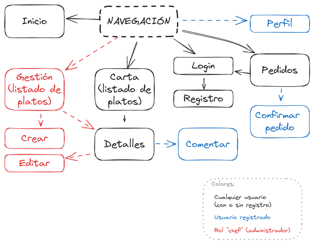

# Proyecto 2º EV - Gestión menús de restaurante

Se implementará una aplicación de gestión de menús de restaurante utilizando **Angular**.

## Objetivos

Aplicación web que permita gestionar los menús de un restaurante, permitiendo a los clientes ver los platos, ingredientes y precios. La aplicación debe facilitar la realización de pedidos, indicar preferencias dietéticas y comentarios de los usuarios, con el objetivo de mejorar la experiencia gastronómica y agilizar el proceso de pedido.

## Características

- Gestionar los platos del restaurante. Crear, editar y eliminar.
- Carta con fotos de los platos y precio.
- Detalles con descripciones, ingredientes y precios.
- Comentarios de los usuarios y valoraciones.
- Realización de pedidos.

## Descripción de las vistas

- **Inicio**. (`\home`) Página de bienvenida con información sobre el restaurante.
- **Carta**. (`\menu`) Listado de platos con foto y precio.
- **Detalles**. (`\dish\:id`) Información detallada de un plato. Listado de comentarios de los usuarios.
- **Pedidos**. (`\cart`) Listado de platos seleccionados por el usuario. Formulario para realizar el pedido.
- **Gestión**. (`\admin`) Listado de platos del restaurante. Formulario para crear y editar platos.
- **Login**. (`\login`)Formulario para iniciar sesión.
- **Registro**. (`\register`) Formulario para crear una cuenta de usuario.
- **Perfil**. (`\profile\:user_id`) Información del usuario. Formulario para editar los datos del usuario.
- **404**. Página de error cuando no se encuentra una ruta.

La vistas presentarán un **menú de navegación** con las siguientes opciones:

- **Logo** del restaurante. Enlaza con la página de inicio.
- **Carta**. Enlaza con la página de la carta.
- **Pedidos**. Enlaza con la página de pedidos.
- **Gestión\***. Enlaza con la página de gestión. *Sólo se muestra para el usuario `chef`.
- Según el estado de la sesión:
    - Si no se ha iniciado sesión:
        - **Iniciar sesión**. Enlaza con la página de login.
    - Si se ha iniciado sesión:
        - **Cerrar sesión**. Cierra la sesión del usuario. Redirige a la página de inicio.
        - **Perfil**. Enlaza con la página de perfil.



[Excalidraw](https://excalidraw.com/#json=imkM2CXmRjLolNlwXLzkJ,RqXi7yNEoukrL-ogvKhBzw)

### Página de inicio

Mostrará una imagen de bienvenida y una breve descripción del restaurante.

### Página de carta

Mostrará un listado de platos disponibles con foto y precio. Al hacer clic en un plato se mostrará la página de detalles.

Se podrá filtrar la carta mediante los siguientes criterios:

- **Ordenar por**.
    - **Precio: de menor a mayor**.
    - **Precio: de mayor a menor**.
- **Categoría**. Ej.: `entrantes`. `platos principales`, `postres`, `bebidas` etc.
- **Ingredientes**. Ej.: `sin gluten`, `sin lactosa`, `vegetariano`, `vegano` etc.

### Página de detalles

Mostrará la información detallada de un plato. Se mostrará una foto, el nombre, la descripción, los ingredientes y el precio.

Se podrá añadir el plato al carrito de la compra.

También se mostrarán los comentarios de los usuarios y la valoración media.

Se podrá añadir un comentario y una valoración. Sólo se podrá comentar si se ha iniciado sesión.

### Página de pedidos

- Listado de platos seleccionados por el usuario y la cantidad de cada plato.
    - Se podrá eliminar un plato del carrito de la compra.

- Precio total del pedido.

- Realizar el pedido:
    - Si el usuario no está registrado, se le pedirá que inicie sesión o se registre para poder completar el pedido.
    - Al ser una aplicación de demostración, simplemente se mostrará un mensaje de confirmación y se vaciará el carrito de la compra.

### Página de gestión

Mostrará un listado de platos del restaurante. Se podrá crear, editar y eliminar platos.

### Página de login

Formulario para iniciar sesión. Se pedirá el nombre de usuario y la contraseña.

### Página de registro

Formulario para crear una cuenta de usuario. Se pedirá el nombre de usuario, la contraseña y el email.

### Página de perfil

Mostrará la información del usuario. Se podrá editar la información del usuario.

### Página de error

Mostrará un mensaje de error cuando no se encuentre una ruta.

## Modelo de datos

### Usuario

- **`id`**. Identificador único.
- **`username`**. Nombre de usuario. **Obligatorio**. Máximo 50 caracteres.
- **`password`**. Contraseña. **Obligatorio**. Máximo 50 caracteres.
- **`email`**. Email. **Obligatorio**. Máximo 50 caracteres.
- **`role`**. Rol del usuario. `user` o `chef`. Por defecto, `user`.

### Plato

- **`id`**. Identificador único.
- **`name`**. Nombre del plato. **Obligatorio**. Máximo 50 caracteres.
- **`description`**. Descripción del plato. **Obligatorio**. Máximo 200 caracteres.
- **`ingredients`**. Ingredientes del plato. **Obligatorio**. Máximo 200 caracteres.
- **`price`**. Precio del plato. **Obligatorio**. Número decimal.
- **`category`**. Categoría del plato. `entrantes`, `platos principales`, `postres`, `bebidas` etc.
- **`enabled`**. Indica si el plato está disponible. Por defecto, `true`. Si está desactivado, no se mostrará en la carta.
- **`image`**. Imagen del plato. **Obligatorio**. URL de la imagen.

### Comentario

- **`id`**. Identificador único.
- **`user_id`**. Identificador del usuario que ha realizado el comentario. **Obligatorio**.
- **`dish_id`**. Identificador del plato comentado. **Obligatorio**.
- **`comment`**. Comentario. **Obligatorio**. Máximo 200 caracteres.
- **`rating`**. Valoración del plato. **Obligatorio**. Número entero entre 1 y 5.
- **`created_at`**. Fecha y hora de creación. Calculada automáticamente. No modificable por el usuario.

### Pedido

- **`id`**. Identificador único.
- **`user_id`**. Identificador del usuario que ha realizado el pedido. **Obligatorio**.
- **`dish_id`**. Identificador del plato pedido. **Obligatorio**.
- **`quantity`**. Cantidad del plato pedido. **Obligatorio**. Número entero.

## API

Se utilizará la API de _JSON Server_ para simular el servidor. Tendrá la siguiente estructura:

```json
{
    "users": [
        {
            "id": "1",
            "username": "chef",
            "password": "chef",
            "email": "chef@test.com",
            "role": "chef"
        },
        {
            "id": "2",
            "username": "user1",
            "password": "1234",
            "email": "user1@test.com",
            "role": "user"
        }
    ],
    "dishes": [
        {
            "id": "1",
            "name": "Ensalada de tomate",
            "description": "Ensalada de tomate con aceite de oliva virgen extra",
            "ingredients": "tomate, aceite de oliva virgen extra, sal, sin gluten, vegano, vegetariano, sin lactosa",
            "price": 5.50,
            "category": "entrantes",
            "image": "https://picsum.photos/200/300"
        }
    ],
    "comments": [
        {
            "id": "1",
            "user_id": "2",
            "dish_id": "1",
            "comment": "Muy buena",
            "rating": 5,
            "created_at": "2024-01-10T12:00:00"
        }
    ],
    "orders": [
        {
            "id": "1",
            "user_id": "2",
            "dish_id": "1",
            "quantity": 2
        }
    ]
}
```

## Requisitos funcionales

- Crear componentes bien definidos y reutilizables.
- Utilizar rutas para navegar entre las diferentes vistas.
- Utilizar servicios y realizar peticiones HTTP.
- Validar formularios.
- Utilizar _pipes_ para formatear los datos.
- Utilizar _guards_ para proteger las rutas.
- Utilizar _interceptors_ para las peticiones HTTP.

## Requisitos de diseño

- Utilizar librerías de componentes y estilos. (_Bootstrap, Material, Tailwind, etc._)
- Utilizar un tema de colores consistente.
- Utilizar tipografías y tamaños de letra accesibles.
- Aplicar heurísticas de usabilidad.
- Interfaz responsiva, adaptada a dispositivos móviles.
- Tamaño de imágenes optimizado.

## Requisitos de implementación

- El proyecto debe estar bien estructurado. Separar el código en componentes y archivos bien definidos.
- Código estructurado. Las clases y funciones están bien comentadas. Los nombres de las clases, funciones y variables son descriptivos.
- No se producen errores de ejecución.

## Entrega

- Fecha límite de entrega **20/02/2024** a las **23:59**.
- Repositorio _GitHub Classroom_: [https://classroom.github.com/a/FpPrX4OO](https://classroom.github.com/a/FpPrX4OO)
- Incluir fichero **`README.md`** en la raíz del proyecto con la siguiente información:
    - Nombre del proyecto.
    - Nombre y apellidos.
    - Detalles de implementación.
- Incluir servidor _JSON Server_ en la carpeta `/server` junto con la base de datos `db.json`.
