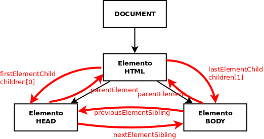

# UD2 - 1. Objetos predefinidos del lenguaje (DOM)

- [Introducción](#introducción)
- [Acceso a los nodos](#acceso-a-los-nodos)
- [Acceso a nodos a partir de otros](#acceso-a-nodos-a-partir-de-otros)
    - [Propiedades de un nodo](#propiedades-de-un-nodo)
- [Manipular el árbol DOM](#manipular-el-árbol-dom)
- [Atributos de los nodos](#atributos-de-los-nodos)
    - [Estilos de los nodos](#estilos-de-los-nodos)
    - [Atributos de clase](#atributos-de-clase)

## Introducción

La mayoría de las veces que programamos con Javascript es para que se ejecute en una página web mostrada por el navegador. En este contexto tenemos acceso a ciertos objetos que nos permiten interactuar con la página (Document Object Model, DOM) y con el navegador (Browser Object Model, BOM).

El **DOM** es una **estructura en árbol** que representa **todos los elementos HTML** de la página y sus atributos. Todo lo que contiene la página se representa como **nodos** del árbol y mediante el DOM podemos acceder a cada nodo, modificarlo, eliminarlo o añadir nuevos nodos de forma que cambiamos dinámicamente la página mostrada al usuario.

La **raíz** del árbol DOM es _**document**_ y de este nodo cuelgan el resto de elementos HTML. Cada uno constituye su propio nodo y tiene subnodos con sus _atributos_, _estilos_ y elementos HTML que contiene. 

Por ejemplo, la página HTML:

```html
<!DOCTYPE html>
<html>
<head>
    <meta charset="utf-8">
    <title>Página simple</title>
</head>
<body>
    <p>Esta página es <strong>muy simple</strong></p>
</body>
</html>
```

se convierte en el siguiente árbol DOM:


Cada etiqueta HTML suele originar 2 nodos:

* `Element`: correspondiente a la etiqueta.
* `Text`: correspondiente a su contenido (lo que hay entre la etiqueta y su par de cierre).

Cada nodo es un objeto con sus propiedades y métodos.

El ejemplo anterior está simplificado porque sólo aparecen los nodos de tipo _**elemento**_ pero en realidad también generan nodos los saltos de línea, tabuladores, espacios, comentarios, etc. En el siguiente ejemplo podemos ver TODOS los nodos que realmente se generan. La página:

```html
<!DOCTYPE html>
<html>
<head>
    <title>My Document</title>
</head>
<body>
    <h1>Header</h1>
    <p>
        Paragraph
    </p>
</body>
</html>
```

se convierte en el siguiente árbol DOM:

<a title="L. David Baron [CC BY-SA 3.0 (https://creativecommons.org/licenses/by-sa/3.0)], via Wikimedia Commons" href="https://commons.wikimedia.org/wiki/File:Dom_tree.png"></a>

## Acceso a los nodos

Los principales métodos para acceder a los diferentes nodos son:

* **`.getElementById(id)`**
  
    Devuelve el nodo con la _`id`_ pasada.
    
    _Ej.:_

    ```html title="index.html" hl_lines="1"
    <div id="main">
        <p>Lorem ipsum</p>
    </div>
    ```

    ```js title="main.js" hl_lines="1"
    let nodo = document.getElementById('main');
    // nodo contendrá el nodo cuya id es "main"
    ```

* **`.getElementsByClassName(clase)`**
    
    Devuelve una **colección** (`Set`, no un array) con todos los nodos de la _clase_ indicada.
    
    _Ej.:_

    ```html title="index.html" hl_lines="3 5-6"
    <h2>Lista</h2>
    <ul>
        <li class="fruta">Manzana</li>
        <li class="verdura">Brócoli</li>
        <li class="fruta">Pera</li>
        <li class="fruta">Kiwi</li>
    </ul>
    ```

    ```js title="main.js" hl_lines="1"
    let frutas = document.getElementsByClassName('fruta');
    // nodos contendrá todos los nodos cuya clase es "fruta"

    Array.from(frutas).forEach(fruta => console.log(fruta.textContent));
    ```

    ```txt title="Consola"
      Manzana
      Pera
      Kiwi
    ```

    !!! note "NOTA:"
        las colecciones son similares a arrays (se accede a sus elementos con _`[indice]`_) pero no se les pueden aplicar sus métodos _`filter`_, _`map`_, _`forEach`_, etc. a menos que se conviertan a arrays con _`Array.from()`_

* **`.getElementsByTagName(etiqueta)`**
    
    Devuelve una **colección** con todos los nodos de la _**etiqueta**_ HTML indicada.
    
    _Ej.:_

    ```html title="index.html" hl_lines="3-5 8-9"
    <h2>Lista</h2>
    <ul id="frutas">
        <li>Manzana</li>
        <li>Pera</li>
        <li>Kiwi</li>
    </ul>
    <ul id="verduras">
        <li>Brócoli</li>
        <li>Berenjena</li>
    </ul>
    ```

    ```js title="main.js" hl_lines="1"
    let nodos = document.getElementsByTagName('li');
    // nodos contendrá todos los nodos de tipo <li>

    Array.from(nodos).forEach(nodo => console.log(nodo.textContent));
    ```

    ```txt title="Consola"
      Manzana
      Pera
      Kiwi
      Brócoli
      Berenjena
    ```

* **`.querySelector(selector)`**
    
    Devuelve el **primer nodo** seleccionado por el **_selector_ CSS** indicado.
    
    _Ej.:_

    ```js
    let nodo = document.querySelector('p.error');
    // nodo contendrá el primer párrafo de clase _error_
    ```

* **`.querySelectorAll(selector)`**
  
    Devuelve una **colección con todos los nodos** seleccionados por el **_selector_ CSS** indicado.
    
    _Ej.:_

    ```javascript
    let nodos = document.querySelectorAll('p.error');
    // nodos contendrá todos los párrafos <p> con clase "error"
    ```

!!! note "NOTA:"
    al aplicar estos métodos sobre _`document`_ se seleccionará sobre la página pero podrían también aplicarse a cualquier nodo y en ese caso la búsqueda se realizaría sólo entre los descendientes de dicho nodo.

También tenemos 'atajos' para obtener algunos elementos comunes:

* `document.documentElement`: devuelve el **nodo** del elemento _`<html>`_
* `document.head`: devuelve el **nodo** del elemento _`<head>`_
* `document.body`: devuelve el **nodo** del elemento _`<body>`_
* `document.title`: devuelve el **nodo** del elemento _`<title>`_
* `document.links`: devuelve una **colección** con todos los **hiperenlaces** del documento
* `document.anchors`: devuelve una **colección** con todas las **anclas** del documento
* `document.forms`: devuelve una **colección** con todos los **formularios** del documento
* `document.images`: devuelve una **colección** con todas las **imágenes** del documento
* `document.scripts`: devuelve una **colección** con todos los **scripts** del documento

!!! question "ACTIVIDAD 1: `📂 UD2/act01/`"
    Descarga [esta página _html_ de ejemplo](./ejercicios/ejemploDOM.html) en el directorio de la actividad.
    
    Crea el archivo **`main.js`**
    
    Incluye el script en la página HTML con un `<script src="main.js">` al final del `<body>` o con un `<script src="main.js" defer>` en el `<head>`.
    
    Añade el código necesario para obtener los siguientes elementos y mostrarlos por consola:

    - El elemento con `id` '`input2`'
    - La colección de párrafos
    - Lo mismo pero sólo de los párrafos que hay dentro del `div` *'lipsum'*
    - El formulario (ojo, no la colección con el formulario sino sólo el formulario)
    - Todos los elementos input
    - Sólo los `input` con nombre *'sexo'*
    - Los items de lista con clase 'important' (sólo los `<li>`)

## Acceso a nodos a partir de otros

En muchas ocasiones queremos acceder a cierto nodo a partir de uno dado. Para ello tenemos los siguientes métodos que se aplican sobre un elemento del árbol DOM:

* **`element.parentElement`**
  
    Devuelve el **nodo padre** de _`element`_

    ```html title="html"
    <div> <!-- nodo padre -->
        <p class="elemento">Este es el párrafo</p> <!-- elemento seleccionado -->
    </div>
    ```

    ```js title="js"
    let element = documento.getElementById('elemento');
    let parent = element.parentElement;
    // parent es el nodo <div>
    ```

* **`elemento.children`**
  
    Devuelve la colección con todos los elementos hijo de _elemento_.
    
    **Sólo elementos HTML**, no comentarios ni nodos de tipo texto.

* **`elemento.childNodes`**
    
    Devuelve la colección con todos los hijos de _elemento_.
    
    **Incluye comentarios y nodos de tipo texto** por lo que no suele utilizarse.

* **`elemento.firstElementChild`**
    
    Devuelve el elemento HTML que es el **primer hijo** de _elemento_ 

* **`elemento.firstChild`**
  
    Devuelve el nodo que es el **primer hijo** de _elemento_.
    
    Incluye nodos de tipo texto o comentarios.

* **`elemento.lastElementChild`**, **`elemento.lastChild`**
    
    Igual que _`firstElementChild`_ y _`firstChild`_ pero con el **último hijo**.

* **`elemento.nextElementSibling`**
    
    Devuelve el elemento HTML que es el siguiente hermano de _elemento_

* **`elemento.nextSibling`**
    
    Devuelve el nodo que es el siguiente hermano de _elemento_.
    
    Incluye nodos de tipo texto o comentarios.

* **`elemento.previousElementSibling`**, **`elemento.previousSibling`**
  
    Igual pero con el hermano anterior.

* **`elemento.hasChildNodes`**
    
    Indica si _elemento_ tiene o no nodos hijos.

* **`elemento.childElementCount`**
    
    Devuelve el número de nodos hijo de _elemento_.

!!! warning "IMPORTANTE:"
    A menos que interesen comentarios, saltos de página, etc., **siempre** se deben usar los métodos que sólo devuelven elementos HTML, no todos los nodos.



!!! question "ACTIVIDAD 2: `📂 UD2/act02/`"
    Siguiendo con la [página de ejemplo](./ejercicios/ejemploDOM.html) y la estructura de la actividad anterior, añade el código necesario para obtener los siguientes elementos y mostrarlos por consola:

    - El **primer párrafo** que hay dentro del `div` con `id` _`'lipsum'`_
    - El **segundo párrafo** de _`'lipsum'`_
    - El **último item** de la **lista**
    - El `label` de *'Escoge sexo'*

### Propiedades de un nodo

Las principales propiedades de un nodo son:

* **`elemento.innerHTML`**
  
    Todo lo que hay entre la etiqueta que abre _elemento_ y la que lo cierra, incluyendo otras etiquetas HTML.
    
    _Ej.:_

    ```html title="html"
    <div id="txt">
        <p>primer parrafo hijo de div id="txt"</p>
        <p>segundo parrafo hijo de id="txt" txt</p>
    </div>
    ```

    ```js title="js" hl_lines="2"
    txt = document.getElementById("txt");
    console.log(txt.innerHTML);

    /*
    Mostrará por consola:
        <p>primer parrafo hijo de div id="txt"</p>
        <p>segundo parrafo hijo de id="txt" txt</p>
    */
    ```

* **`elemento.textContent`**

    Todo lo que hay entre la etiqueta que abre _elemento_ y la que lo cierra, pero ignorando otras etiquetas HTML.

    Podemos usarlo tanto para leer como para escribir el contenido de un nodo.
    
    _Ej.:_

    ```html title="html"
    <p id="texto">Esto <span>es</span>un texto</p>
    ```

    ```js title="js" hl_lines="2 6"
    // Lee el contenido:
    var text = document.getElementById("texto").textContent;
    // |text| contiene la cadena "Esto es un texto".

    // Escribe el contenido:
    document.getElementById("texto").textContent = "Nuevo texto";

    // Se ha modificado el HTML en tiempo de ejecución,
    // ahora contiene una nueva cadena:
    //     <p id="texto">Nuevo texto</p>
    ```

* **`elemento.value`**
    
    Devuelve la propiedad *`value`* de un `<input>` (en el caso de un `<input>` de tipo text devuelve lo que hay escrito en él).
    
    Como los `<input>` no tienen etiqueta de cierre (`</input>`) no podemos usar _`.innerHTML`_ ni _`.textContent`_.

    _Por ejemplo_ si _`elem1`_ es el nodo `<input name="nombre">` y _`elem2`_ es el nodo `<input type="radio" value="H"> Hombre`

    ```html title="html"
    <form action="#">
        <label for="nombre">Nombre:</label>
        <input type="text" id="nombre" name="nombre">

        <fieldset>
            <legend>Lenguaje favorito:</legend>
            <div>
                <input type="radio" name="fav" id="html" value="HTML">
                <label for="html">HTML</label>
            </div>
            <div>
                <input type="radio" name="fav" id="css" value="CSS">
                <label for="css">CSS</label>
            </div>
            <div>
                <input type="radio" name="fav" id="js" value="JavaScript" checked>
                <label for="js">JavaScript</label>
            </div>
        </fieldset>
    </form>
    ```

    ```js title="js" hl_lines="2 6"
    let inputNombre = document.getElementById('nombre');
    let name = inputNombre.value;
    // | name | Contiene lo que haya escrito en el <input> en ese momento

    let favChecked = document.querySelector('input[name="fav"]:checked');
    let favorite = favChecked.value;
    // | favorite | Contiene "JavaScript"
    ```

Otras propiedades:

* `elemento.innerText`: Se recomienda no usarlo, es similar a _`textContent`_
* `elemento.focus`: da el foco a _elemento_ (para inputs, etc.).
* `elemento.blur`: quita el foco de _elemento_.
* `elemento.clientHeight` / `elemento.clientWidth`: devuelve el alto / ancho visible del _elemento_
* `elemento.offsetHeight` / `elemento.offsetWidth`: devuelve el alto / ancho total del _elemento_
* `elemento.clientLeft` / `elemento.clientTop`: devuelve la distancia de _elemento_ al borde izquierdo / superior
* `elemento.offsetLeft` / `elemento.offsetTop`: devuelve los píxels que hemos desplazado _elemento_ a la izquierda / abajo

!!! question "ACTIVIDAD 3: `📂 UD2/act03/`"
    Siguiendo con la [página de ejemplo](./ejercicios/ejemploDOM.html) y la estructura de la actividad anterior, añade el código necesario para realizar las los siguientes operaciones:

    - Selecciona y muestra por consola el `innerHTML` de la etiqueta de _'Escoge sexo'_.
    - Selecciona y muestra por consola `textContent` de esa etiqueta.
    - Modifica el `textContent` de esa etiqueta para que ponga _'Género:'_.
    - Selecciona y muestra por consola valor del primer `input` de _'sexo'_.
    - Selecciona y muestra por consola valor del _'sexo'_ que esté seleccionado.

## Manipular el árbol DOM

Vamos a ver qué métodos nos permiten cambiar el árbol DOM, y por tanto modificar el HTML de la página:

* **`document.createElement('etiqueta')`**
    
    crea un nuevo elemento HTML con la etiqueta indicada, pero aún no se añade a la página. _Ej.:_

    ```javascript
    let nuevoLi = document.createElement('li');
    ```

* **`document.createTextNode('texto')`**
    
    crea un nuevo nodo de texto con el texto indicado, que luego tendremos que añadir a un nodo HTML. _Ej.:_

    ```javascript
    let textoLi = document.createTextNode('Nuevo elemento de lista');
    ```

* **`elemento.appendChild(nuevoNodo)`**:

    añade _nuevoNodo_ como último hijo de _elemento_. Ahora ya se ha añadido a la página. _Ej.:_

    ```js hl_lines="5 11"
    let nuevoLi = document.createElement('li');
    let textoLi = document.createTextNode('Nuevo elemento de lista');

    // añade el texto creado al elemento <li> creado
    nuevoLi.appendChild(textoLi);

    // selecciona el 1º <ul> de la página
    let miPrimeraLista = document.getElementsByTagName('ul')[0];

    // añade <li> como último hijo de <ul>, es decir al final de la lista
    miPrimeraLista.appendChild(nuevoLi);
    ```

* **`elemento.insertBefore(nuevoNodo, nodo)`**
    
    añade _nuevoNodo_ como hijo de _elemento_ antes del hijo _nodo_. _Ej.:_

    ```js hl_lines="8"
    // selecciona el 1º <ul> de la página
    let miPrimeraLista = document.getElementsByTagName('ul')[0];

    // selecciona el 1º <li> dentro de miPrimeraLista
    let primerElementoDeLista = miPrimeraLista.getElementsByTagName('li')[0];

    // añade <li> al principio de la lista
    miPrimeraLista.insertBefore(nuevoLi, primerElementoDeLista);
    ```

* **`elemento.removeChild(nodo)`**
    
    borra _nodo_ de _elemento_ y por tanto se elimina de la página. _Ej.:_

    ```js hl_lines="8 11"
    // selecciona el 1º <ul> de la página
    let miPrimeraLista = document.getElementsByTagName('ul')[0];

    // selecciona el 1º <li> dentro de miPrimeraLista
    let primerElementoDeLista = miPrimeraLista.getElementsByTagName('li')[0];

    // borra el primer elemento de la lista
    miPrimeraLista.removeChild(primerElementoDeLista);

    // También podríamos haberlo borrado sin tener el padre con:
    primerElementoDeLista.parentElement.removeChild(primerElementoDeLista);
    ```

* **`elemento.replaceChild(nuevoNodo, viejoNodo)`**

    reemplaza _viejoNodo_ con _nuevoNodo_ como hijo de _elemento_. _Ej.:_

    ```js hl_lines="13"
    // crea el nodo
    let nuevoLi = document.createElement('li');
    let textoLi = document.createTextNode('Nuevo elemento de lista');
    nuevoLi.appendChild(textoLi);

    // selecciona el 1º <ul> de la página
    let miPrimeraLista = document.getElementsByTagName('ul')[0];

    // selecciona el 1º <li> de miPrimeraLista
    let primerElementoDeLista = miPrimeraLista.getElementsByTagName('li')[0];

    // reemplaza el 1º elemento de la lista con nuevoLi
    miPrimeraLista.replaceChild(nuevoLi, primerElementoDeLista);
    ```

* **`elementoAClonar.cloneNode(boolean)`**
    
    devuelve una copia de _elementoAClonar_ o de _elementoAClonar_ con todos sus descendientes según le pasemos como parámetro _`false`_ o _`true`_. Luego podremos insertarlo donde queramos.

    !!! warning "MUCHO CUIDADO"
        Si añadimos con el método `appendChild` un nodo que estaba en otro sitio **se elimina de donde estaba** para añadirse a su nueva posición.
        
        Si queremos que esté en los 2 sitios deberé clonar el nodo y luego añadir la copia y no el nodo original.

**Ejemplo de creación de nuevos nodos**: tenemos un código HTML con un DIV que contiene 3 párrafos y vamos a añadir un nuevo párrafo al final del div con el texto 'Párrafo añadido al final' y otro que sea el 2º del div con el texto 'Este es el <strong>nuevo</strong> segundo párrafo':

<script async src="//jsfiddle.net/juansegura/qfcdseua/embed/js,html,result/"></script>

Si utilizamos la propiedad **innerHTML** el código a usar es mucho más simple:

<script async src="//jsfiddle.net/juansegura/x9s7v8kn/embed/js,html,result/"></script>

!!! warning "**CUIDADO**"
    La forma de añadir el último párrafo (línea #3: `miDiv.innerHTML+='<p>Párrafo añadido al final</p>';`) aunque es válida no es muy eficiente ya que obliga al navegador a volver a pintar TODO el contenido de miDIV. La forma correcta de hacerlo sería:

    ```javascript
    let ultimoParrafo = document.createElement('p');
    ultimoParrafo.innerHTML = 'Párrafo añadido al final';
    miDiv.appendChild(ultimoParrafo);
    ```

    Así sólo debe repintar el párrafo añadido, conservando todo lo demás que tenga _miDiv_.

Podemos ver más ejemplos de creación y eliminación de nodos en [W3Schools](http://www.w3schools.com/js/js_htmldom_nodes.asp).

!!! question "ACTIVIDAD 3: `📂 UD2/act04/`"
    Siguiendo con la [página de ejemplo](./ejercicios/ejemploDOM.html) y la estructura de la actividad anterior, añade el código necesario para añadir a la página:

    - Un nuevo párrafo al final del DIV _'lipsum'_ con el texto "Nuevo párrafo **añadido** por javascript" (fíjate que una palabra esta en negrita)
    - Un nuevo elemento al formulario tras el _'Dato 1'_ con la etiqueta _'Dato 1 bis'_ y el INPUT con id _'input1bis'_ que al cargar la página tendrá escrito "Hola" 

## Atributos de los nodos

Podemos ver y modificar los valores de los atributos de cada elemento HTML y también añadir o eliminar atributos:

* **`elemento.attributes`**: devuelve un array con todos los atributos de _elemento_
* **`elemento.hasAttribute('nombreAtributo')`**: indica si _elemento_ tiene o no definido el atributo _nombreAtributo_
* **`elemento.getAttribute('nombreAtributo')`**: devuelve el valor del atributo _nombreAtributo_ de _elemento_. Para muchos elementos este valor puede directamente con `elemento.atributo`. 
* **`elemento.setAttribute('nombreAtributo', 'valor')`**: establece _valor_ como nuevo valor del atributo _nombreAtributo_ de _elemento_. También puede cambiarse el valor directamente con `elemento.atributo=valor`.
* **`elemento.removeAttribute('nombreAtributo')`**: elimina el atributo _nombreAtributo_ de _elemento_

A algunos atributos comunes como `id`, `title` o `className` (para el atributo **class**) se puede acceder y cambiar como si fueran una propiedad del elemento (`elemento.atributo`). Ejemplos:

```javascript
// selecciona el 1º <ul> de la página
let miPrimeraLista = document.getElementsByTagName('ul')[0];

miPrimeraLista.id = 'primera-lista';
// es equivalente ha hacer:
miPrimeraLista.setAttribute('id', 'primera-lista');
```

### Estilos de los nodos

Los estilos están accesibles como el atributo **style**. Cualquier estilo es una propiedad de dicho atributo pero con la sintaxis _camelCase_ en vez de _kebab-case_. Por ejemplo para cambiar el color de fondo (propiedad background-color) y ponerle el color _rojo_ al elemento _miPrimeraLista_ haremos:

```javascript
miPrimeraLista.style.backgroundColor = 'red';
```

De todas formas normalmente **NO CAMBIAREMOS ESTILOS** a los elementos sino que les pondremos o quitaremos clases que harán que se le apliquen o no los estilos definidos para ellas en el CSS.

### Atributos de clase

Ya sabemos que el aspecto de la página debe configurarse en el CSS por lo que no debemos aplicar atributos _style_ al HTML. En lugar de ello les ponemos clases a los elementos que harán que se les aplique el estilo definido para dicha clase.

Como es algo muy común en lugar de utilizar las instrucciones de `elemento.setAttribute('className', 'destacado')` o directamente `elemento.className='destacado'` podemos usar la propiedad **_[classList](https://developer.mozilla.org/es/docs/Web/API/Element/classList)_** que devuelve la colección de todas las clases que tiene el elemento. Por ejemplo si _elemento_ es `<p class="destacado direccion">...`: 

```javascript
// clases=['destacado', 'direccion'], OJO es una colección, no un Array
let clases=elemento.classList;
```

Además dispone de los métodos:

* **`.add(clase)`**: añade al elemento la clase pasada (si ya la tiene no hace nada). Ej.:
```javascript
elemento.classList.add('primero');   // ahora elemento será <p class="destacado direccion primero">...
```
* **`.remove(clase)`**: elimina del elemento la clase pasada (si no la tiene no hace nada). Ej.:
```javascript
elemento.classList.remove('direccion');   // ahora elemento será <p class="destacado primero">...
```
* **`.toogle(clase)`**: añade la clase pasada si no la tiene o la elimina si la tiene ya. Ej.:

    ```javascript
    elemento.classList.toogle('destacado');
    // ahora elemento será <p class="primero">...
    
    elemento.classList.toogle('direccion');
    // ahora elemento será <p class="primero direccion">...
    ```

* **.contains(clase)**: dice si el elemento tiene o no la clase pasada. Ej.:

    ```javascript
    elemento.classList.contains('direccion');
    // devuelve true
    ```

* **.replace(oldClase, newClase)**: reemplaza del elemento una clase existente por una nueva. Ej.:

    ```javascript
    elemento.classList.replace('primero', 'ultimo');
    // ahora elemento será <p class="ultimo direccion">...
    ```

Tened en cuenta que NO todos los navegadores soportan _classList_ por lo que si queremos añadir o quitar clases en navegadores que no lo soportan debemos hacerlo con los métodos estándar, por ejemplo para añadir la clase 'rojo':

```javascript
let clases = elemento.className.split(" ");
if (clases.indexOf('rojo') == -1) {
  elemento.className += ' ' + 'rojo';
}
```

!!! question "ACTIVIDAD 4: `📂 UD2/act04/`"
    En esta actividad tendrás que crear una página que permita generar una tabla de tamaño variable, seleccionar una celda al azar y borrar la tabla.

    - Crea los archivos **`index.html`** y **`main.js`** en el directorio de la actividad.
    - Dale una estructura básica a la página `index.html` y añade un el script `main.js`.
    - Crea los siguientes elementos en la página:
        - Un `<input type="text">` con `id` _`'table_x'`_
        - Un `<input type="text">` con `id` _`'table_y'`_
        - Un botón `<button>` con `id` _`'generar'`_ y texto _`'Generar'`_, añade el atributo `onclick` con el valor _`'generarTabla()'`_
        - Añade un `<button>` con `id` _`'borrar'`_ y texto _`'Borrar'`_, añade el atributo `onclick` con el valor _`'borrarTabla()'`_
        - Un `<div>` con `id` _`'tabla'`_
        - Un `<ol>` con `id` _`'seleccion'`_
    - En `main.js` crea una función **_`generarTabla()`_** que:
        - Lea los valores de los `<input>` de _`'table_x'`_ y _`'table_y'`_
        - Cree una tabla de _`table_x`_ filas y _`table_y`_ columnas dentro del `<div>` _`'tabla'`_
        - Cada celda de la tabla tendrá un un `id` _`'celda_x_y'`_ donde _`x`_ es el número de fila y _`y`_ el número de columna. El texto del `<span>` será _`'x,y'`_.
    - Función **_`borrar()`_** que:
        - Limpie el contenido del `<div>` _`'tabla'`_, los valores del formulario y el contenido del `<ol>` _`'seleccion'`_.
    - Función **_`seleccionaCelda()`_** que:
        - Seleccione una celda al azar de la tabla y cambie su color de fondo, por ejemplo a rojo.
        - Añada un nuevo elemento `<li>` al `<ol>` _`'seleccion'`_ con el texto de la celda seleccionada (_`'x,y'`_).
        - Modifica `index.html` para aparezca un botón _`'Seleccionar'`_ y en el atributo `onclick` valor _`'seleccionaCelda()'`_.
        - Si existen celdas seleccionadas con anterioridad, se debe cambiar el color de fondo a otro distinto de la seleccionada actualmente, por ejemplo a gris.

    - _Opcional:_
        - _쯈ué ocurre si se pulsa el botón _`'Generar'`_ sin haber borrado la tabla anterior? Implementa una solución._

    _**Nota**: Cuando veamos eventos podremos utilizar tablas para realizar algún juego como el buscaminas, el tres en raya, etc._
