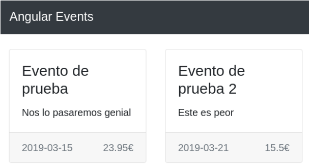

# UD 6 - Actividad 1

Vamos a ir implementando poco a poco un proyecto de gestión de eventos (deportivos, conciertos, etc.). Para esta actividad crea un proyecto llamado **`angular-eventos`**.

**Crea un componente** llamado **`eventos-show`**. Contendrá casi todo el HTML que necesitaremos en el ejercicio. Crea también una interfaz llamada **`Evento`** (`evento.ts`) que representará los datos de un evento (título, imagen, fecha, descripción y precio).

```typescript
export interface Evento {
  id: string;
  title: string;
  image: string;
  date: string;
  description: string;
  price: number;
}
```

Debes tener el siguiente código HTML en la plantilla del componente principal de la aplicación (`AppComponent`):

```html
<nav class="navbar navbar-expand-lg navbar-dark bg-dark">
    <div class="container-fluid">
        <a class="navbar-brand" href="#">Angular Events</a>
    </div>
</nav>
<div class="container">
    <!-- Insertar aquí el componente eventos-show -->
</div>
```

Este será el esqueleto de la plantilla del componente `EventosShowComponent` (a falta de listar los eventos):

```html
<div class="mb-4 mt-4 row row-cols-1 row-cols-md-2 row-cols-xl-3 g-4">
    <!-- Aquí listaremos los eventos -->
</div>
```

No olvides instalar _**Bootstrap**_ e incluir el CSS correspondiente en el proyecto! (ver explicación en los apuntes)

## Listando los eventos

En el componente **`EventosShowComponent`**, crea un **array** de objetos **`Evento`** (el tipo será `Evento[]`). Crea al menos 2 eventos con todos sus datos. La imagen la puedes dejar como cadena vacía por ahora, más adelante veremos como mostrarla. La fecha debe ser una cadena en formato ‘`YYYY-MM-DD`’.

Esta es una estructura HTML de ejemplo de un evento (dentro del elemento `<div class="mb-4 mt-4 ...">`, repetir con la directiva `@for`):

```html
<div class="col">
    <div class="card">
        <div class="card-body">
            <h4 class="card-title">Título del evento</h4>
            <p class="card-text">Descripción del evento</p>
        </div>
        <div class="card-footer text-muted">
            Fecha del evento
            <span class="float-end">Precio del evento€</span>
        </div>
    </div>
</div>
```

Si el array de eventos está vacío, con las directivas `@if` y `@else`, muestra el mensaje "_`No hay eventos disponibles`_" dentro de un `<h3>`, por ejemplo.

El resultado será algo parecido a esto:


