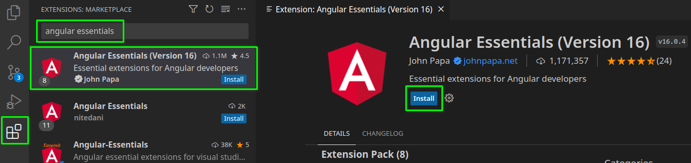

# UD6 - 1. Introducción a Angular

## Introducción

Angular es un **framework para el desarrollo de aplicaciones web** en el lado del cliente (_frontend_). Es decir, es un conjunto de herramientas que nos facilitan el desarrollo de aplicaciones web, y que se ejecutan en el navegador del cliente.

Está **desarrollado en _TypeScript_**. Este lenguaje es básicamente _JavaScript_ con características adicionales, las más destacables son el **tipado** de variables y funciones. Esto **mejora la depuración** de aplicaciones en tiempo de desarrollo, el **autocompletado** por parte del editor (_intellisense_), etc. Al pasar por un proceso de transpilado a _JavaScript_, el resultado será **código compatible** con todos los navegadores actuales.

Algunas de las **principales características** de _Angular_ son:

- Introduce **expresividad en el código HTML** a través de la interpolación de variables, _data-binding_, directivas, etc.
- Tiene un **diseño modular**. Sólo se importan las características que necesitamos en la aplicación (mejora de tamaño y rendimiento). Además permite separar nuestra aplicación en módulos de forma que el navegador vaya cargando en cada momento lo que necesita (lazy loading) → Mejora de tiempos de carga.
- Es fácil crear **componentes reutilizables** para la aplicación actual u otras.
- La **integración con un servidor** de _backend_ basado en servicios web es muy sencilla.
- Permite ejecutar **_Angular_ en el lado del servidor** para generar contenido estático que puedan indexar los motores de búsqueda (incapaces de ejecutar ellos _Angular_ en el cliente). Esta característica se llama _Angular Universal_ o **_Server Side Rendering_**.
- Potentes **herramientas de desarrollo y depuración**: _TypeScript_, _Angular DevTools_ (plugin de Chrome), frameworks de pruebas como _Karma_ o _Jasmine_, etc.
- **Integración con frameworks de diseño** como _Bootstrap_, _Angular Material_, _Ionic_, etc.
- Crea **aplicaciones de una página** (**SPA** - _Single Page Applications_), donde la página principal se carga entera sólo una vez → Mejor rendimiento.
- Debido a su naturaleza de **framework completo y modular**, es la solución más efectiva para desarrollar **grandes aplicaciones**.

En resumen, vamos a aprender un framework completo y muy popular, desarrollado y usado por _Google_, y con herramientas orientadas a facilitar el desarrollo de grandes aplicaciones.

## Preparar el entorno de desarrollo

Para desarrollar aplicaciones con _Angular_ necesitaremos instalar:

- [**_Node.js (lts)_**](#instalar-nodejs-lts): Es un entorno de ejecución de _JavaScript_ en el lado del servidor. Nos permite ejecutar _JavaScript_ fuera del navegador, y nos proporciona un gestor de paquetes (_npm_) para instalar librerías de terceros.
- [**_Angular CLI_**](#instalar-angular-cli): Es una herramienta de línea de comandos que nos permite crear y gestionar proyectos de _Angular_. Se instala a través de _npm_.
- [**_Visual Studio Code_**](https://code.visualstudio.com/): Es un editor de código gratuito y multiplataforma, desarrollado por _Microsoft_. Es uno de los editores más populares para desarrollar aplicaciones con _Angular_.
- [**_Git_**](https://git-scm.com/downloads): Es un sistema de control de versiones distribuido, que nos permite trabajar en equipo de forma eficiente.
- [**_Angular DevTools_**](#instalar-angular-devtools): Es un plugin para el navegador _Chrome_ que nos permite depurar aplicaciones _Angular_.
- Extensión **[_Angular Essentials (Version 16)_](#instalar-angular-essentials-para-visual-studio-code)** para **_Visual Studio Code_**: Es una extensión para _Visual Studio Code_ que nos proporciona herramientas para desarrollar aplicaciones _Angular_.


### Instalar _Node.js (lts)_

!!! note "Instalación de _Node.js_ con permisos de administrador"
    Para instalar _Node.js_, en _Windows_ podemos descargar el instalador desde la [página oficial](https://nodejs.org/en). En _Linux_ podemos instalarlo a través del gestor de paquetes de la distribución.

**En los ordenadores del aula** tendremos que instalar _Node.js_ en nuestro perfil de usuario, ya que no tenemos permisos de administrador. Para ello, utilizaremos la herramienta [**_nvm_** (_Node Version Manager_)](https://github.com/nvm-sh/nvm#installing-and-updating) que nos permite instalar y gestionar varias versiones de _Node.js_ en nuestro perfil de usuario:

- Abrimos una terminal.
- Ejecutamos el siguiente comando para instalar _`nvm`_:

    ```bash
    curl -o- https://raw.githubusercontent.com/nvm-sh/nvm/v0.39.5/install.sh | bash
    ```

- Cerramos la terminal y la volvemos a abrir. Esto permite que recargue las variables de entorno y reconozca el comando _`nvm`_.
- Ejecutamos el siguiente comando para instalar la versión _lts_ de _Node.js_:

    ```bash title="Comando:"
    nvm install --lts
    ```

    ```bash title="Salida:"
    Downloading and installing node v20.9.0...
    Local cache found: ${NVM_DIR}/.cache/bin/node-v20.9.0-linux-x64/node-v20.9.0-linux-x64.tar.xz
    Checksums match! Using existing downloaded archive ${NVM_DIR}/.cache/bin/node-v20.9.0-linux-x64/node-v20.9.0-linux-x64.tar.xz
    Now using node v20.9.0 (npm v10.1.0)
    ```

- Ejecutamos el siguiente comando para comprobar que se ha instalado correctamente:

    ```bash title="Comando:"
    node -v; npm -v
    ```

    ```text title="Salida:"
    v20.9.0
    10.1.0
    ```

### Instalar _Angular CLI_

_Angular CLI_ es una herramienta de línea de comandos que nos permite crear y gestionar proyectos _Angular_. Para instalarla, ejecutamos el siguiente comando:

```bash
npm install -g @angular/cli
```

Para comprobar que se ha instalado correctamente, ejecutamos el siguiente comando:

```bash title="Comando:"
ng version
```

```text title="Salida:"

     _                      _                 ____ _     ___
    / \   _ __   __ _ _   _| | __ _ _ __     / ___| |   |_ _|
   / . \ | '_ \ / _` | | | | |/ _` | '__|   | |   | |    | |
  / ___ \| | | | (_| | |_| | | (_| | |      | |___| |___ | |
 /_/   \_\_| |_|\__, |\__,_|_|\__,_|_|       \____|_____|___|
                |___/
    

Angular CLI: 17.0.1
Node: 20.9.0
Package Manager: npm 10.1.0
OS: linux x64

Angular: 
... 

Package                      Version
------------------------------------------------------
@angular-devkit/architect    0.1700.1 (cli-only)
@angular-devkit/core         17.0.1 (cli-only)
@angular-devkit/schematics   17.0.1 (cli-only)
@schematics/angular          17.0.1 (cli-only)
```

### Instalar _Angular DevTools_

_Angular DevTools_ es un plugin para el navegador _Chrome_ que nos permite depurar aplicaciones _Angular_. Para instalarlo, abrimos _Chrome_ y accedemos a la [página de la extensión](https://chromewebstore.google.com/detail/angular-devtools/ienfalfjdbdpebioblfackkekamfmbnh). Pulsamos el botón **Añadir a Chrome** y confirmamos la instalación.

### Instalar _Angular Essentials_ para _Visual Studio Code_

Para instalar la extensión _Angular Essentials (Version 16)_ para _Visual Studio Code_, abrimos _Visual Studio Code_ y pulsamos el botón **Extensiones** en la barra lateral izquierda. En el cuadro de búsqueda escribimos el nombre de la extensión (_"Angular Essentials"_) y pulsamos el botón **Instalar**.


