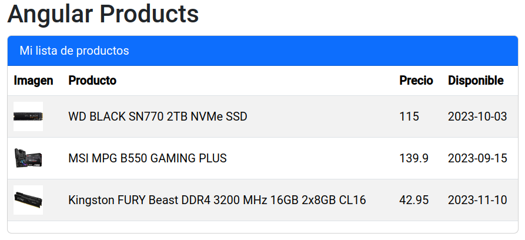
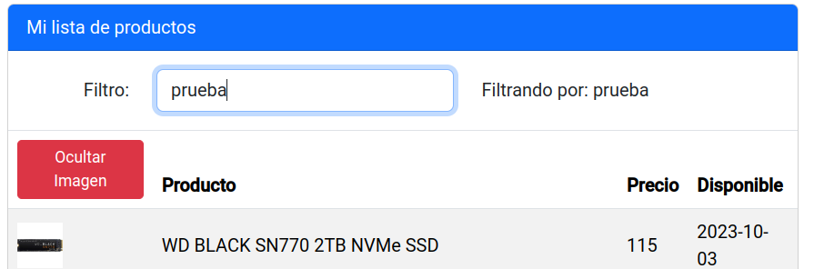
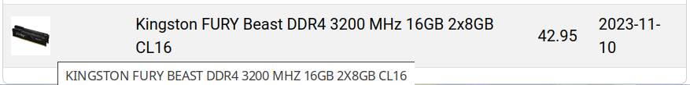
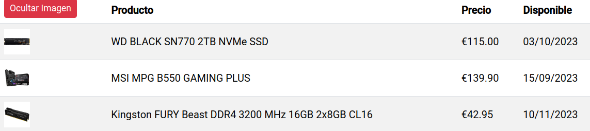
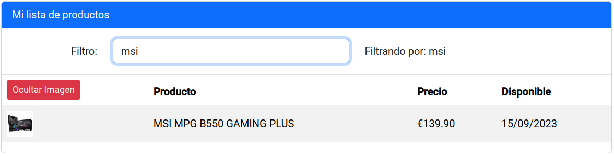

# UD6 - 2. Data binding. Pipes.

## Vincular atributos (Property binding)

De forma similar a la {{interpolación}}, podemos vincular atributos de elementos HTML a propiedades de la clase del componente. En lugar de usar dobles llaves, usaremos corchetes.

Siguiendo con el ejemplo de la primera parte, vamos a mostrar la imagen de cada producto en la primera columna de la tabla. Las imágenes, al igual que otros archivos multimedia o de texto auxiliares se deben situar en la carpeta `src/assets` del proyecto, que será exportada tal cual al compilarlo.

```html title="products-list.component.html" hl_lines="13"
      <table class="table table-striped">
        <thead>
          <tr>
            <th>{{headers.image}}</th>
            <th>{{headers.description}}</th>
            <th>{{headers.price}}</th>
            <th>{{headers.available}}</th>
          </tr>
        </thead>
        <tbody>
          @for(product of products; track product.id) {
          <tr>
            <td></td>
            <td>{{product.description}}</td>
            <td>{{product.price}}</td>
            <td>{{product.available}}</td>
          </tr>
          }
        </tbody>
      </table>
```

Se podría haber usado la interpolación para mostrar la imagen, pero no es recomendable. Si la imagen no existe, se mostraría el texto `undefined` en lugar de la imagen. Además, si se inspecciona el código HTML generado, se puede ver que la imagen se ha cargado correctamente.

```html
 <!-- CORRECTO: vinculación de atributo -->

 <!-- EVITAR!: interpolación -->
```

Al igual que los atributos HTML, podemos vincular estilos CSS (_style binding_) a valores calculados. Para ello, se usa el atributo `style`, seguido del nombre de la propiedad CSS (en formato _camelCase_), y si esta lo requiere, el tipo de unidad de medida. Por ejemplo, si queremos establecer una altura en píxeles almacenada en una propiedad llamada `imageHeight` → **`[style.height.px]="imageHeight"`**.

Para añadir CSS a la plantilla de un componente, se usa el archivo de estilo asociado a la plantilla → `src/app/products-list/product-list.component.css`:

```css title="products-list.component.css"
td {
    vertical-align: middle;
}

td:first-child img {
    height: 40px;
}
```



## `ngStyle` y `ngClass`

En lugar de usar el atributo `style` para vincular estilos CSS, podemos usar la directiva `ngStyle`. Esta directiva recibe un objeto con pares clave-valor, donde la clave es el nombre de la propiedad CSS y el valor es el valor de la propiedad. Por ejemplo, si queremos establecer una altura en píxeles almacenada en una propiedad llamada `imageHeight` → **`[ngStyle]="{'height.px': imageHeight}"`**.

Ejemplos de uso de `ngStyle`:

- Si la propiedad `isEven: boolean` es `true`, el color de fondo de la celda será rojo, y cuando sea `false` pasará a ser verde:

    ```html
    <td [ngStyle]="{'background-color': isEven ? 'red' : 'green'}">...</td>
    ```

- Para especificar unidades (`px`, `em`, `rem`, ...), se añade como sufijo al nombre de la propiedad CSS, separado por un punto.

    ```html
    <td [ngStyle]="{'height.px': imageHeight}">...</td>
    ```

- Para aplicar más de un estilo, se pueden añadir más pares clave-valor al objeto:

    ```html
    <td [ngStyle]="{'height.px': imageHeight, 'background-color': isEven ? 'red' : 'green'}">...</td>
    ```

- Se puede crear el objeto con las propiedades dentro del componente y luego vincularlo a la directiva `ngStyle`:

    ```typescript
    @Component({
        selector: 'app-test',
        templateUrl: './test.component.html',
        styleUrls: ['./test.component.css']
    })

    export class TestComponent {
        imageHeight = 40;
        isEven = true;
        styles = {
            height: this.imageHeight + 'px',
            'background-color': this.isEven ? 'red' : 'green'
        };
        ...
    }
    ```

    ```html
    <td [ngStyle]="styles">...</td>
    ```

La directiva `ngClass` permite añadir clases CSS a un elemento HTML.

```html
<td [ngClass]="{'even': isEven, 'last active': isLast}">
```

Al igual que con `ngStyle`, se puede crear el array u objeto con las clases dentro del componente y luego vincularlo a la directiva `ngClass`.

```typescript
@Component({
    selector: 'app-test',
    templateUrl: './test.component.html',
    styleUrls: ['./test.component.css']
})

export class TestComponent {
    isEven = true;
    isLast = false;
    classes = {
        'even': isEven,
        'last': isLast,
        'active': isLast};
    ...
}
```

```html
<td [ngClass]="classes">...</td>
```

## Vincular eventos (Event binding)

Al igual que con los atributos, podemos vincular eventos de elementos HTML a métodos de la clase del componente. En este caso, la información fluye en sentido contrario, desde la plantilla al componente.

Para vincular un evento, se usa el nombre del evento entre paréntesis, seguido de un igual y el nombre del método a ejecutar. Por ejemplo, si queremos ejecutar el método `onSelectedItem()` cuando se haga `click` en un elemento → **`(click)="onSelectedItem()"`**.

Se va a añadir un botón para ocultar y mostrar las imágenes de la tabla:

```html title="products-list.component.html" linenums="1" hl_lines="12-16 26-31"
<div class="card">
  <div class="card-header bg-primary text-white">
    {{title}}
  </div>
  <div class="card-block">
    @if(products && products.length) {
    <div class="table-responsive">
      <table class="table table-striped">
        <thead>
          <tr>
            <th>
              <button class="btn btn-sm"
                      [ngClass]="{'btn-danger': showImage, 'btn-primary': !showImage}"
                      (click)="toggleImage()">
                {{showImage ? 'Ocultar' : 'Mostrar'}} {{headers.image}}
              </button>
            </th>
            <th>{{headers.description}}</th>
            <th>{{headers.price}}</th>
            <th>{{headers.available}}</th>
          </tr>
        </thead>
        <tbody>
          @for(product of products; track product.id) {
          <tr>
            @if(showImage) {
            <td></td>
            }
            @else {
            <td></td>
            }
            <td>{{product.description}}</td>
            <td>{{product.price}}</td>
            <td>{{product.available}}</td>
          </tr>
          }
        </tbody>
      </table>
    </div>
    }
    @else {
    <div class="alert alert-info">
      No hay productos
    </div>
    }
  </div>
</div>
```

Necesitaremos importar el módulo `CommonModule` para poder usar la directiva `ngClass`:

```typescript title="products-list.component.ts" linenums="1" hl_lines="2 8 15 17-19"
import { Component } from '@angular/core';
import { CommonModule } from '@angular/common';
import { Product } from '../interfaces/product';

@Component({
  selector: 'app-products-list',
  standalone: true,
  imports: [CommonModule],
  templateUrl: './products-list.component.html',
  styleUrl: './products-list.component.css'
})
export class ProductsListComponent {
  title = 'Mi lista de productos';
  headers = { description: 'Producto', price: 'Precio', available: 'Disponible', image: 'Imagen' };
  showImage = true;

  toggleImage(): void {
    this.showImage = !this.showImage;
  }

  products: Product[] = [
    {
      id: 1,
      description: 'WD BLACK SN770 2TB NVMe SSD',
      available: '2023-10-03',
      price: 115,
      imageUrl: 'assets/ssd.jpg',
      rating: 5
    }, {
      id: 2,
      description: 'MSI MPG B550 GAMING PLUS ',
      available: '2023-09-15',
      price: 139.90,
      imageUrl: 'assets/motherboard.png',
      rating: 4
    },
    {
      id: 3,
      description: 'Kingston FURY Beast DDR4 3200 MHz 16GB 2x8GB CL16',
      available: '2023-11-10',
      price: 42.95,
      imageUrl: 'assets/ram.png',
      rating: 3
    }
  ];

  constructor() { }
}
```

## Vinculación bidireccional `[(ngModel)]`

Hemos visto como vincular unidireccionalmente los valores de atributos HTML (componente → plantilla) y los eventos generados (plantilla → componente). Existe también un tipo de vinculación bidireccional a través de la directiva `ngModel`, utilizada generalmente con elementos de tipo `<input>`.

Se utiliza combinando paréntesis y corchetes `[(ngModel)]`, se vincula el valor del campo del formulario a una propiedad del componente, de tal forma que si cambiamos el valor en la propiedad, se haría visible ese cambio en el campo y viceversa, si cambiamos el valor del campo, cambia el de la propiedad del componente.

La directiva `ngModel` se encuentra en el módulo `FormsModule`, por lo que hay que importarlo en el módulo de la aplicación.

```typescript title="products-list.component.ts" hl_lines="2 6"
...
import { FormsModule } from '@angular/forms';
...
@Component({
  ...
  imports: [CommonModule, FormsModule],
  ...
})
export class ProductsListComponent {
    ...
```

A continuación, se añade un campo de texto para filtrar los productos por nombre. Para ello, se va a crear una nueva propiedad en el componente llamada `filterText` y se va a vincular con el campo de texto.

```html title="products-list.component.html" hl_lines="3"
export class ProductsListComponent {
 ...
 filterSearch = ''; // Podríamos poner un valor por defecto
 ...
```

A continuación se crea un formulario, antes de la tabla de productos con un campo de texto, que se usará para filtrar los productos. Además, se mostrará un texto al lado con el valor actual de la propiedad `filterSearch`, para observar como cambia al escribir en el campo de texto.

```html title="products-list.component.html" hl_lines="4-19"
  ...
  <div class="card-block">
    @if(products && products.length) {
    <form class="form p-3 border-bottom">
      <div class="form-group row">
        <label class="col-form-label col-sm-2 text-sm-end"
               for="filterDesc">Filtro:</label>
        <div class="col-sm-5">
          <input type="text"
                 [(ngModel)]="filterSearch"
                 class="form-control"
                 name="filterDesc"
                 id="filterDesc"
                 placeholder="filtro...">
        </div>
        <label class="col-form-label col-sm-5">
          Filtrando por: {{filterSearch}}</label>
      </div>
    </form>
    <div class="table-responsive">
        ...
```
 


## Filtros (`Pipes`)

Los filtros o _pipes_ son funciones que se aplican a los datos antes de mostrarlos en la plantilla, transforman la información antes de mostrarla. Angular dispone de varios filtros predefinidos, pero también se pueden crear filtros personalizados. Los filtros se aplican después de la propiedad o expresión que se quiere mostrar, separados por el carácter `|`.

Los filtros predefinidos se encuentran en el módulo `CommonModule`, que ya hemos importado para usar la directiva `ngClass`. 

```typescript title="products-list.component.ts" hl_lines="2 6"
De esta forma, se podrá aplicar en la plantilla del componente:

```html title="products-list.component.html" hl_lines="2"
            <td></td>
```

El filtro `uppercase` convierte el texto a mayúsculas.



Algunos filtros admiten parámetros, que se indican entre paréntesis.

El filtro `currency` admite como parámetro el símbolo de la moneda, por defecto es `$`. Para indicar el símbolo del euro, se debe indicar como parámetro `'EUR':'symbol'`. También se puede indicar el número de decimales, por defecto son 2.

El filtro `date` admite como parámetro el formato de la fecha. Para indicar el formato, se debe indicar, en este caso `dd/MM/y`.

```html title="products-list.component.html"
    ...
    <td>{{product.price | currency:'EUR':'symbol'}}</td>
    <td>{{product.available | date:'dd/MM/y'}}</td>
    ...
```



## Crear filtros personalizados

Como ya se ha visto, los filtros permiten transformar los datos antes de mostrarlos en la plantilla. También podemos crear filtros personalizados. Por ejemplo, un filtro que transforme el array de productos en un array de productos filtrados por el nombre.

Se utiliza el comando `ng generate pipe` para crear un filtro. En este caso, se va a crear un filtro llamado `product-filter` dentro del directorio `pipes`:

```bash
ng generate pipe pipes/product-filter
```

Recuerda utilizar la sintaxis `snake-case` desde la línea de comandos. En este caso, el filtro se llamará `productFilter` y su clase `ProductFilterPipe`.

```typescript title="pipes/product-filter.pipe.ts" linenums="1"
import { Pipe, PipeTransform } from '@angular/core';

@Pipe({
  name: 'productFilter',
  standalone: true
})
export class ProductFilterPipe implements PipeTransform {

  transform(value: unknown, ...args: unknown[]): unknown {
    return null;
  }

}
```

Se puede observar que es similar a la clase de un componente, pero usa el decorador `@Pipe`, para que `Angular` sepa que se trata de un filtro. El nombre, `productFilter`, es el que se usará en la plantilla para aplicar el filtro.

Esta clase implementa la interfaz `PipeTransform`, que implementa el método `transform`, que será el encargado de aplicar el filtro. Gracias a _TypeScript_, se puede limitar el tipo de datos de entrada (parámetro `value`) para que sea un array de productos. En este caso sólo tendrá un parámetro, llamado `filterBy` que será un `string` para filtrar productos por nombre.

```typescript title="pipes/product-filter.pipe.ts" linenums="1" hl_lines="10-17"
import { Pipe, PipeTransform } from '@angular/core';
import { Product } from '../interfaces/product';

@Pipe({
  name: 'productFilter',
  standalone: true
})
export class ProductFilterPipe implements PipeTransform {
  // transform(value: unknown, ...args: unknown[]): unknown {
  transform(products: Product[], filterBy: string): Product[] {
    const filter = filterBy ? filterBy.toLocaleLowerCase() : null;
    if (filter) {
      return products.filter((product: Product) =>
        product.description.toLocaleLowerCase().includes(filter));
    }
    return products;
  }
}
```

Ahora se puede usar el filtro en la plantilla del componente. Primero se importa el filtro y, en la plantilla `products-list.component.html`, se aplica el filtro a los productos que recorre la directiva `@for`. Se añade el filtro `productFilter` y se le pasa como parámetro el valor de la propiedad `filterSearch`.

```typescript title="products-list.component.ts" hl_lines="2 8"
...
import { ProductFilterPipe } from '../pipes/product-filter.pipe';

@Component({
  ...
  imports: [
    ...
    ProductFilterPipe
  ],
  ...
})
export class ProductsListComponent {
  ...
```

```html title="products-list.component.html" hl_lines="2"
    ...
    @for(product of products | productFilter:filterSearch; track product.id) {
    ...
```



## Encapsulación de estilos

Al crear un componente con _Angular CLI_ (`ng`), se genera un archivo CSS asociado, que se referencia en el decorador `@Component`. Estos estilos sólo afectan a la plantilla del componente, no a otros componentes. Esto se conoce como **encapsulación de estilos**.

Para aislar los estilos, Angular genera atributos únicos para cada elemento de la plantilla. 

```html
  ...
    <table _ngcontent-ng-c1570407183="" class="table table-striped">
    <thead _ngcontent-ng-c1570407183="">
        <tr _ngcontent-ng-c1570407183="">
        <th _ngcontent-ng-c1570407183=""><button _ngcontent-ng-c1570407183="" class="btn btn-sm btn-danger" ng-reflect-ng-class="[object Object]"> Ocultar Imagen </button></th>
        <th _ngcontent-ng-c1570407183="">Producto</th>
        <th _ngcontent-ng-c1570407183="">Precio</th>
        <th _ngcontent-ng-c1570407183="">Disponible</th>
        </tr>
    </thead>
    <tbody _ngcontent-ng-c1570407183="">
        <tr _ngcontent-ng-c1570407183="">
        <td _ngcontent-ng-c1570407183=""></td>
        <!--container--><!--container-->
        <td _ngcontent-ng-c1570407183="">WD BLACK SN770 2TB NVMe SSD</td>
        <td _ngcontent-ng-c1570407183="">€115.00</td>
        <td _ngcontent-ng-c1570407183="">03/10/2023</td>
        </tr>
  ...
```

Para definir estilos globales hay dos opciones:

- Crear los estilos en el archivo `src/styles.css`.

    ```css title="src/styles.css"
    /* You can add global styles to this file, and also import other style files */
    @import "../node_modules/bootstrap/dist/css/bootstrap.min.css";

    html, body { height: 100%; }
    body { margin: 0; font-family: Roboto, "Helvetica Neue", sans-serif; }
    ```

- Incluir los archivos CSS en el archivo `angular.json` en la sección `styles`.

    ```json title="angular.json"
    ...
            "styles": [
              "@angular/material/prebuilt-themes/indigo-pink.css",
              "src/styles.css"
            ],
    ...
    ```

## Actividad 2

[Actividad 2](actividades/ud6-act2.md)
