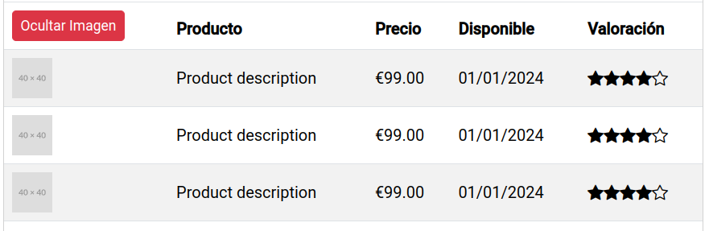
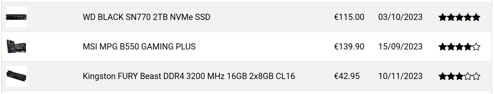
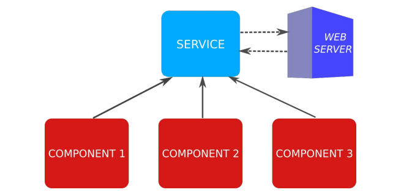

# UD6 - 3. Componentes anidados. Servicios

## Componentes anidados

Tal como se vió en la unidad anterior, los componentes pueden anidarse unos dentro de otros. Por ejemplo, cada elemento de una lista puede separarse en un componente independiente.

Para el ejemplo se va a crear un nuevo componente llamado `product-item` que representará cada uno de los productos de la lista. El componente `product-list` se modificará para que utilice el nuevo componente.

```bash
ng g component product-item
```

También se creará un componente que servirá para puntuar un producto, que estará anidado dentro de `product-item`.

```bash
ng g component star-rating
```

### Anidando componentes

El nuevo componente `product-item` se utilizará para representar cada uno de los productos de la lista. De momento, se usarán datos estáticos para representar los productos, más adelante obtendrá los datos del componente padre.

```typescript title="product-item.component.ts" linenums="1"
import { Component } from '@angular/core';
import { Product } from '../interfaces/product';
import { CommonModule } from '@angular/common';

@Component({
  selector: 'app-product-item',
  standalone: true,
  imports: [CommonModule],
  templateUrl: './product-item.component.html',
  styleUrl: './product-item.component.css'
})
export class ProductItemComponent {
  product: Product = {
    id: 0,
    description: 'Product placeholder',
    available: '2024-01-01',
    price: 9999,
    imageUrl: 'https://placehold.co/400',
    rating: 5
  };

  showImage = true;
  
  constructor() { }
}
```

Se almacena la información del producto en una variable llamada `product` que se utilizará a mode de _placeholder_ para maquetar la información. La plantilla HTML del componente se modificará para que utilice esta información.

```html title="product-item.component.html" linenums="1"
<tr>
  <td>
    
  </td>
  <td>{{ product.description }}</td>
  <td>{{ product.price | currency:'EUR':'symbol' }}</td>
  <td>{{ product.available | date:'dd/MM/y' }}</td>
</tr>
```

Básicamente, se ha copiado el código HTML de la tabla de la lista de productos, para que muestre una fila de la tabla `<tr>`. Ahora se puede modificar el componente `products-list` para que utilice el nuevo componente.

```html title="products-list.component.html"
...
        <tbody>
          @for(product of products | productFilter:filterSearch; track product.id) {
          <app-product-item></app-product-item>
          }
        </tbody>
...
```

Debemos importar el componente `ProductItemComponent` en `products-list.component.ts`:

```typescript title="products-list.component.ts" hl_lines="2 8"
...
import { ProductItemComponent } from '../product-item/product-item.component';

@Component({
  ...
  imports: [
    ...
    ProductItemComponent
  ],
  ...
})
export class ProductsListComponent {
  ...
```

También se debe mover los estilos CSS de la tabla a `product-item.component.css`:

```css title="product-item.component.css"
td {
  vertical-align: middle;
}

td:first-child img {
  height: 40px;
}
```


Se puede observar que la estructura de la tabla no es correcta, hay un problema con las filas `<tr>` y las columnas `<td>`. Esto se debe a que el componente `<app-product-item>` está situado entre la tabla y cada fila y el navegador no puede interpretar correctamente la estructura de la tabla.

### Solución. Selector de atributo y clase

En el selector del componente, en lugar de crear un nuevo elemento `selector: 'app-product-item'`, se puede utilizar un selector, tipo CSS, de clase `selector: '.product-item'` o de atributo `selector: '[app-product-item]'`. De esta forma, el componente se cargará dentro del elemento al que se añada esta clase o atributo y no se creará un componente adicional.

```typescript title="product-item.component.ts" hl_lines="3"
...
@Component({
  selector: '[app-product-item]',
  ...
})
export class ProductItemComponent {
...
```

Se elimina la etiqueta `<tr>` de la plantilla HTML del componente `product-item` al componente `product-item`:

```html title="product-item.component.html" linenums="1"
<td></td>
<td>{{product.description}}</td>
<td>{{product.price | currency:'EUR':'symbol'}}</td>
<td>{{product.available | date:'dd/MM/y'}}</td>
```

Ahora, la plantilla HTML del componente `products-list` se puede modificar para que utilice el selector de atributo:

```html title="products-list.component.html" hl_lines="4"
...
        <tbody>
          @for(product of products | productFilter:filterSearch; track product.id) {
          <tr app-product-item></tr>
          }
        </tbody>
...
```


### Anidar `StarRatingComponent`

El siguiente paso es implementar el componente `star-rating`, que presentará un sistema de puntuación de 1 a 5, representado con estrellas. Para mostrar las estrellas se podrían utilizar caracteres unicode (★/☆) o imágenes. En este caso se utilizarán imágenes de la librería bootstrap-icons.

```bash
npm install bootstrap-icons
```

Y se añade a `styles.css` para que cargue los iconos de bootstrap:

```css title="styles.css" linenums="1" hl_lines="3"
/* You can add global styles to this file, and also import other style files */
@import "../node_modules/bootstrap/dist/css/bootstrap.min.css";
@import "../node_modules/bootstrap-icons/font/bootstrap-icons.min.css";

html, body { height: 100%; }
body { margin: 0; font-family: Roboto, "Helvetica Neue", sans-serif; }
```

Ahora se va a crear el código del componente `star-rating`:

```typescript title="star-rating.component.ts" linenums="1"
import { CommonModule } from '@angular/common';
import { Component } from '@angular/core';

@Component({
  selector: 'app-star-rating',
  standalone: true,
  imports: [CommonModule],
  templateUrl: './star-rating.component.html',
  styleUrl: './star-rating.component.css'
})
export class StarRatingComponent {
  rating = 4;
}
```

Y la plantilla HTML:

```html title="star-rating.component.html" linenums="1"
<div class="star-container">
  @for(star of [1,2,3,4,5]; track $index) {
  <i [ngClass]="{'bi-star-fill': star <= rating, 'bi-star': star > rating}"></i>
  }
</div>
```

Con el componente creado, se debe importar en `product-item.component.ts`:

```typescript title="product-item.component.ts" hl_lines="2 8"
...
import { StarRatingComponent } from '../star-rating/star-rating.component';

@Component({
  ...
  imports: [
    CommonModule,
    StarRatingComponent
  ],
  ...
})
export class ProductItemComponent {
  ...
```

A continuación, se modifica la plantilla HTML del componente `product-item` para añadir un nuevo elemento `<td>` con la valoración del producto:

```html title="product-item.component.html" linenums="1" hl_lines="7"
<td></td>
<td>{{product.description}}</td>
<td>{{product.price | currency:'EUR':'symbol'}}</td>
<td>{{product.available | date:'dd/MM/y'}}</td>
<td><app-star-rating></app-star-rating></td>
```



## Comunicación entre componentes anidados

En el ejemplo anterior, el componente `product-item` se ha creado con datos estáticos. Aún no se ha implementado la funcionalidad para presentar los datos de cada producto, puesto que aún no sabemos cómo se comunican los componentes entre sí.

### Decorador `@input`

Para indicar que un componente recibe datos de entrada por parte del componente padre, creamos una nueva propiedad y la decoramos con `@Input()`. Esto indica a _Angular_, que el valor de la propiedad será obtenido a partir de un atributo con el mismo nombre, en el selector HTML del componente actual.

A modo de ejemplo, se va a pasar al componente `product-item`, los datos del producto a mostrar y el booleano que indica si la imagen debe mostrarse:

```html title="products-list.component.html" hl_lines="5-6"
...
        <tbody>
          @for(product of products | productFilter:filterSearch; track product.id) {
          <tr app-product-item
              [product]="product"
              [showImage]="showImage">
          </tr>
          }
        </tbody>
...
```

Y se modifica el componente `product-item.component.ts` para que reciba los datos del producto y el booleano:

```typescript title="product-item.component.ts" hl_lines="1 4-5"
import { Component, Input } from '@angular/core';
...
export class ProductItemComponent {
  @Input() product!: Product;
  @Input() showImage!: boolean;
  
  constructor() { }
}
```

El símbolo `!` indica que la propiedad puede ser `null` o `undefined`, pero que no se inicializará en el constructor. Esto es debido a que el valor de la propiedad se obtendrá del componente padre, por lo que no es necesario inicializarla.

Para terminar, se debe modificar el componente `star-rating` para que reciba la valoración del producto:

```html title="product-item.component.html"
<td><app-star-rating [rating]="product.rating"></app-star-rating></td>
```

```typescript title="star-rating.component.ts" hl_lines="1 4"
import { Component, Input } from '@angular/core';
...
export class StarRatingComponent {
  @Input() rating!: number;
}
```



### Decorador `@output`

Para comunicar un componente hijo con el padre, se utiliza el decorador `@Output()`. Este decorador se utiliza para indicar que un componente hijo puede emitir un evento que será capturado por el componente padre.

Se va a implementar una funcionalidad para que cuando se sitúe el puntero encima de una estrella, cambiar la puntuación del producto. Para ello, no se debe modificar el valor de la propiedad de entrada `@Input()`, ya que se disvincularía del padre y dejarían de actualizarse los datos automáticamente. Se creará una propiedad auxiliar `auxRating` inicializada al mismo valor recibido del componente padre.

Cuando se retire el cursor del componente, se restablecerá el valor de `auxRating` a la puntuación original:

```typescript title="star-rating.component.ts"
import { Component, Input } from '@angular/core';
import { CommonModule } from '@angular/common';

@Component({
  selector: 'app-star-rating',
  standalone: true,
  imports: [CommonModule],
  templateUrl: './star-rating.component.html',
  styleUrl: './star-rating.component.css'
})
export class StarRatingComponent {
  auxRating!: number;
  @Input() rating!: number;

  ngOnInit() {
    this.restoreRating();
  }

  restoreRating() {
    this.auxRating = this.rating;
  }
}
```

En la plantilla HTML, se añade un evento `mouseover` que llamará al método `setRating` cuando el puntero se sitúe encima de una estrella, y otro evento `mouseleave` que llamará al método `restoreRating` cuando el puntero se retire del componente:

```html title="star-rating.component.html" linenums="1"
<div class="star-container" (mouseleave)="restoreRating()">
  @for(star of [1,2,3,4,5]; track $index) {
  <i [ngClass]="{'bi-star-fill': star <= auxRating, 'bi-star': star > auxRating}"
     (mouseenter)="auxRating = star"></i>
  }
</div>
```

De esta forma funciona al pasar el puntero por encima, pero falta que se actualice al hacer clic sobre una estrella. Para ello se va a utilizar el decorador `@Output()` para emitir un evento cuando se haga clic sobre una estrella. Este evento será capturado por el componente padre, que actualizará la puntuación del producto.

```html title="star-rating.component.html" linenums="1" hl_lines="5"
<div class="star-container" (mouseleave)="restoreRating()">
  @for(star of [1,2,3,4,5]; track $index) {
  <i [ngClass]="{'bi-star-fill': star <= auxRating, 'bi-star': star > auxRating}"
     (mouseenter)="auxRating = star"
     (click)="setRating()">
  </i>
  }
</div>
```

Esto hará que el método `setRating()` emita un evento al componente padre con la nueva puntuación. Para ello, se crea un emisor de eventos con el decorador `@Output`. El evento se llamará `ratingChanged` y emitirá un número, que será la nueva puntuación del producto.

```typescript title="star-rating.component.ts" hl_lines="5 7-9"
...
export class StarRatingComponent {
  ...

  @Output() ratingChanged = new EventEmitter<number>();

  setRating() {
    this.ratingChanged.emit(this.auxRating);
  }

  ...
}
```

En el componente `product-item` se capturará el evento `ratingChanged`, se accederá al valor emitido (la nueva puntuación) con la variable especial `$event`. En este caso, como se modifica la propiedad de un objeto, no hace falta que lo haga el componente padre `products-list` que contiene el array de objetos, ya que los objetos siempre se pasan por referencia.

```html title="product-item.component.html" hl_lines="4"
...
<td>
  <app-star-rating [rating]="product.rating"
                   (ratingChanged)="changeRating($event)"/>
</td>
```

```typescript title="product-item.component.ts" hl_lines="5-7"
...
export class ProductItemComponent {
  ...
  
  changeRating(rating: number) {
    this.product.rating = rating;
  }
}
```

## Servicios. Inyección de dependencias

Un **Servicio** es una clase cuyo propósito es mantener una lógica (y datos) compartidos entre diferentes componentes de la aplicación. Esto es útil tanto para agrupar funcionalidad común de varios componentes, como para compartir datos entre componentes que no tengan relación de parentesco.

También se recomienda su uso para acceder a datos externos (servicios web). Cuando un componente de Angular (o filtro, o directiva, u otro servicio, etc.) necesita usar un servicio, existe un componente interno llamado inyector de dependencias (común en muchos frameworks), que nos proveerá el objeto de dicho servicio. Sólo se creará como máximo una instancia de dicho servicio para la aplicación (_Singleton_).



En la aplicación de ejemplo, se usa un Servicio para almacenar los productos, que en el futuro se obtendrá de un servicio web. Por ahora se creará en un directorio llamado `services/`:

```bash
ng g service services/product
```

Esto creará un archivo `product.service.ts` con la clase del servicio. Esta clase está precedida con el decorador `@Injectable()`, que indica que la clase es un servicio y que puede ser inyectado en otros componentes.

```typescript title="product.service.ts" linenums="1"
import { Injectable } from '@angular/core';

@Injectable({
  providedIn: 'root'
})
export class ProductService {
  constructor() { }
}
```

En la clase del servicio, se creará un método que devuelva el array de productos:

```typescript title="product.service.ts" linenums="1" hl_lines="11-35"
import { Injectable } from '@angular/core';
import { Product } from '../interfaces/product';

@Injectable({
  providedIn: 'root'
})
export class ProductService {

  constructor() { }

  getProducts(): Product[] {
    return [{
      id: 1,
      description: 'WD BLACK SN770 2TB NVMe SSD',
      available: '2023-10-03',
      price: 115,
      imageUrl: 'assets/ssd.jpg',
      rating: 5
    }, {
      id: 2,
      description: 'MSI MPG B550 GAMING PLUS ',
      available: '2023-09-15',
      price: 139.90,
      imageUrl: 'assets/motherboard.png',
      rating: 4
    },
    {
      id: 3,
      description: 'Kingston FURY Beast DDR4 3200 MHz 16GB 2x8GB CL16',
      available: '2023-11-10',
      price: 42.95,
      imageUrl: 'assets/ram.png',
      rating: 3
    }];
  }
}
```


Ahora que los productos están en el servicio, se debe hacer que el componente `products-list` los obtenga de ahí. Para “inyectar” el servicio en el componente, _Angular_ utiliza una característica de _TypeScript_. Si se declaras en el constructor un parámetro con el modificador `public` o `private` en el constructor, _TypeScript_ declara un atributo
en la clase con el mismo nombre y hace una asignación del parámetro automática.

Indicando el tipo de parámetro `ProductService`, al ser una clase de tipo servicio (`@Injectable`), _Angular_ pasa automáticamente un objeto de dicha clase (creándolo si es la primera vez que se utiliza) al constructor. Esto es la inyección
de dependencias.

Finalmente, en el método `ngOnInit`, se llama al método del servicio que devuelve los productos. Como ya es necesario, se borra el contenido del array de productos y se inicializa como array vacío (en lugar de no darle valor), ya que si no, podría fallar el `@for` (el atributo estaría undefined) mientras se obtienen los datos. Esto es porque en un entorno real, el servidor tendrá un retardo en devolver los datos, y si _Angular_ intenta recorrer los productos antes de eso a partir de un array sin valor (undefined), aparecería un error.

```typescript title="products-list.component.ts" linenums="1" hl_lines="1 28 30 32-34"
import { Component, OnInit } from '@angular/core';
import { FormsModule } from '@angular/forms';
import { CommonModule } from '@angular/common';
import { Product } from '../interfaces/product';
import { ProductFilterPipe } from '../pipes/product-filter.pipe';
import { ProductItemComponent } from '../product-item/product-item.component';
import { ProductService } from '../services/product.service';

@Component({
  selector: 'app-products-list',
  standalone: true,
  imports: [
    CommonModule,
    FormsModule,
    ProductFilterPipe,
    ProductItemComponent
  ],
  templateUrl: './products-list.component.html',
  styleUrl: './products-list.component.css'
})
export class ProductsListComponent implements OnInit {
  title = 'Mi lista de productos';
  headers = { description: 'Producto', price: 'Precio', available: 'Disponible', image: 'Imagen', rating: 'Valoración' };
  showImage = true;

  filterSearch = '';

  products: Product[] = [];

  constructor(private productService: ProductService) { }

  ngOnInit() {
    this.products = this.productService.getProducts();
  }

  toggleImage(): void {
    this.showImage = !this.showImage;
  }
}
```

## Actividad 3

[Actividad 3](actividades/ud6-act3.md)
