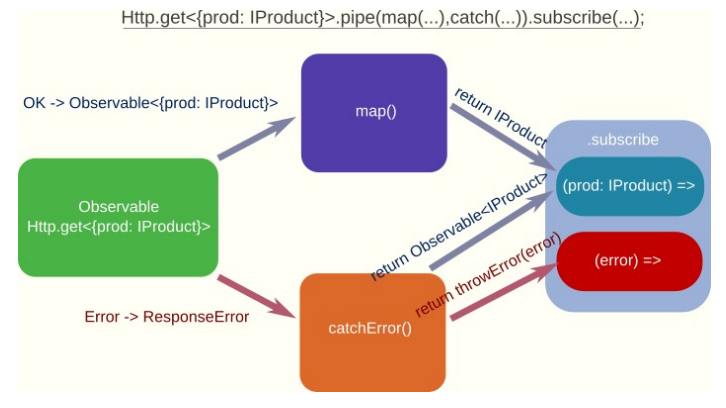

# UD6 - 4. HttpClient

## El módulo HttpClient

En las aplicaciones reales se obtienen los datos de un servicio web utilizando peticiones HTTP en segundo plano (asíncronas). Angular proporciona el servicio `HttpClient` para realizar peticiones HTTP. 

Este servicio se encuentra en el módulo `@angular/common/http`, por lo que debemos importarlo en la configuración principal de la aplicación. Debemos importar el `provideHttpClient()` en `app.config.ts`:

```typescript title="app.config.ts" linemums="1" hl_lines="5 9"
import { ApplicationConfig } from '@angular/core';
import { provideRouter } from '@angular/router';

import { routes } from './app.routes';
import { provideAnimations } from '@angular/platform-browser/animations';
import { provideHttpClient } from '@angular/common/http';

export const appConfig: ApplicationConfig = {
  providers: [
    provideHttpClient(),
    provideRouter(routes),
    provideAnimations()
  ]
};
```

Se va a modificar el servicio `ProductoService` para que obtenga los datos de un servicio web. Para ello, se va a utilizar el servicio `HttpClient` de Angular. Este servicio se inyecta en el constructor del servicio `ProductoService`:

```typescript title="src/app/services/product.service.ts" linenums="1" hl_lines="3 9 11 15-17"
import { Injectable } from '@angular/core';
import { Observable } from 'rxjs';
import { HttpClient } from '@angular/common/http';

import { Product } from '../interfaces/product';

@Injectable({ providedIn: 'root' })
export class ProductService {
  private productsEndpoint = 'https://localhost:3000/products';

  constructor(private http: HttpClient) { }

  // obtiene todos los productos
  // GET /products
  getProducts(): Observable<Product[]> {
    return this.http.get<Product[]>(this.productsEndpoint);
  }
}
```

- Se importa el servicio `HttpClient` de `@angular/common/http`.
- Se crea la propiedad `productsEndpoint` que contiene la URL del servicio web.
- Se inyecta el servicio `HttpClient` en el constructor del servicio `ProductoService`.
- En el método `getProducts()` se utiliza el método `get()` del servicio `HttpClient` para realizar una petición HTTP GET a la URL del servicio web. Este método devuelve un objeto `Observable` que contiene un array de productos. Más adelante veremos qué es un `Observable`.

## Repaso de los métodos básicos HTTP

La petición y respuesta del servidor será mediante el protocolo HTTP. Cuando hacemos una petición HTTP, el navegador envía al servidor: cabeceras (como `useragent` el cual identifica al navegador, las preferencias de idioma, etc.), el tipo de petición HTTP y parámetros o datos (si son necesarios).

Hay muchos tipos de petición que podemos enviarle al servidor. Los más usados cuando realizamos una llamada AJAX (o accedemos a un servicio web) son:

- `GET`: se utiliza para obtener datos del servidor. No modifica los datos del servidor.
- `POST`: se utiliza para enviar datos al servidor. Creando un nuevo recurso.
- `PUT`: se utiliza para **actualizar** datos. Sustituye todos los datos del recurso.
- `PATCH`: se utiliza para **actualizar parcialmente** datos en el servidor. Sólo actualiza los datos que se envían en la petición.
- `DELETE`: se utiliza para eliminar datos en el servidor.

## RxJS y Observables

Se podría trabajar con _**Promesas**_ para realizar las peticiones HTTP. Sin embargo, _Angular_ trabaja por defecto con la librería **RxJS**. Es decir, utiliza **Observables**, que son como una versión más avanzada de las promesas.

Estas son algunas diferencias entre usar promesas y observables:

- Una **Promesa** devuelve un sólo valor futuro (lo que para una petición HTTP es suficiente). Un **Observable** puede emitir varios valores a lo largo del tiempo.

- Una **Promesa** se ejecuta (el código interno) cuando se crea. Un **Observable** sólo
empieza cuando alguien se suscribe a él (_lazy loading_).

- Una **Promesa** no puede ser cancelada, mientras que un **Observable** puede dejar
de ejecutarse si se cancelan las suscripciones a él.

- Los **observables** tienen muchos métodos (operadores) como `map`, `filter`, `reduce`, etc. Las **promesas** usan el método genérico `then` para todo.

Cualquier llamada http (`get`, `post`, `put`, `delete`, etc.) devuelve un Observable (una operación futura). Para obtener los datos que vaya a emitir dicho Observable en el futuro, debemos suscribirnos a él.

Sin embargo, podemos establecer un procesamiento intermedio de los datos, entre la respuesta que nos llega en “crudo” del servidor y el dato que realmente queremos guardar/mostrar, usando operadores intermedios como `map`, `filter`, `tap`, etc.

Esto es lo que hacen los métodos nombrados anteriormente:

- **`map`** : Obtiene el dato devuelto por el Observable (o el operador anterior si concatenamos varios), aplicamos alguna transformación al dato y la devolvemos (el método devolverá `Observable<DatoTransformado>`).
- **`tap`** : Se utiliza normalmente para operaciones de depuración (mostrar datos por consola, etc.). No devolvemos nada en este método porque automáticamente devuelve un Observable con el mismo dato que recibe (no modifica nada).
- **`filter`** : Cuando el observable devuelve más de un dato a lo largo del tiempo (por ejemplo si trabajamos con eventos). Este método sólo dejará pasar aquellos que cumplan una determinada condición (devolvemos un booleano).

Los operadores se importan de `rxjs/operators`, y se aplican como parámetros del método pipe de la clase `Observable` en el orden establecido (encadenados).

## Procesando respuestas con Observables

Cada vez que un observable emite un valor, este se puede procesar con los métodos u operadores intermedios nombrados antes. Sin embargo, el observable no empieza a emitir valores (no se ejecuta su código interno) hasta que nos suscribimos a él (pueden haber varias suscripciones al mismo observable).

Para suscribirnos debemos llamar al método `subscribe`. Este método es un **método final**, lo que significa que ya no podemos encadenar nada más después.

Este método puede recibir hasta tres parámetros, que deben ser funciones:

- La primera función recibirá el resultado final devuelto por el observable (y procesado por los métodos intermedios).
- Si se produce algún error en el observable (o lo lanzamos nosotros en algún método intermedio) se llamará en su lugar a la segunda función (opcional), que recibirá dicho error.
- La tercera función (opcional) se ejecutará al final siempre independientemente de si se produce algún error o no. Es el mismo concepto que el bloque `finally` de una estructura `try...catch`.

```typescript
Observable.pipe( map(…), catchError(…) ).subscribe(
    (result) => // Procesar los datos devueltos
    (error) => // Procesar el error
    () => // Se ejecutará siempre al final (sin parámetro)
)
```

Sin embargo, a veces podríamos querer recuperarnos de un error, o simplemente procesar el error y devolverlo en un formato diferente. Para ello tenemos el operador `catchError`. Este método intermedio sólo se ejecuta si se produce algún error en el observable o en un método intermedio anterior.

Si queremos recuperarnos del error, debemos devolver un nuevo observable con datos correctos (podría ser otra llamada HTTP por ejemplo). Por otro lado, si queremos seguir con el error pero cambiando el formato, debemos devolver un observable con error (método `throwError`).

El siguiente esquema muestra un ejemplo de una llamada HTTP, y qué podríamos hacer si todo va bien o se produce un error (hay muchas posibilidades). En este caso el método catchError podría devolver datos válidos de alguna manera (recuperación de error) o formatear el error.

Finalmente, como dijimos anteriormente, si al método subscribe le llega un dato sin error se ejecutará la primera función, mientras que en caso de error se ejecutará la segunda en su lugar.



_Ejemplo de uso_: Partiendo de una respuesta **JSON** con la siguiente estructura:

```json
{
  "products": [
    {
      "id": 1,
      "description": "WD BLACK SN770 2TB NVMe SSD",
      "price": 115,
      "available": "2023-10-03",
      "imageUrl": "http://placehold.it/200x100",
      "rating": 5
    },
    {
        ...
    },
  ]
}
```

Para obtener sólo el array de productos, se utiliza método `map`, a su vez, se capturan los posibles errores con `catchError` y se formatean con `throwError`:

```typescript
  getProducts(): Observable<Product[]> {
    return this.http.get<{ products: Product[] }>(this.productsEndpoint).pipe(
      map(response => response.products),
      catchError((resp: HttpErrorResponse) =>
        throwError(() =>
          new Error(`Error obteniendo productos. Código de servidor: ${resp.status}. Mensaje: ${resp.message}`))
      ));
  }
```

Otro método útil para la recuperación de errores es `retry`. Cuando llega la cadena de procesamiento a este método, si se detecta que ha habido un error, se reinicia el observable (se vuelve a ejecutar desde el principio) tantas veces como le indiquemos por parámetro. Si se supera el número de reintentos y sigue habiendo un error, entonces se deja pasar.

Por ejemplo, para repetir la llamada HTTP 3 veces antes de darnos por vencidos (por si la red funcionara mal):

```typescript hl_lines="3"
  getProducts(): Observable<Product[]> {
    return this.http.get<{ products: Product[] }>(this.productsEndpoint).pipe(
      retry(3),
      map(response => response.products),
      catchError((resp: HttpErrorResponse) =>
        throwError(() =>
          new Error(`Error obteniendo productos. Código de servidor: ${resp.status}. Mensaje: ${resp.message}`))
      ));
  }
```

## Obtención de datos en el servicio de _Angular_

Muchas veces, el servidor nos devolverá una respuesta en formato JSON. Generalmente, los datos que queremos obtener se encontrarán dentro de ese objeto JSON, o también puede que queramos hacer ciertas transformaciones intermedias como pasar las fechas de `string` a objeto `Date`, etc. Para ello se usa el método `map`.

Además de crear interfaces para cada tipo de objetos que maneje el programa (productos, usuarios, etc.), es una buena idea crear una o varias interfaces para "mapear" la respuesta del servidor:

```typescript title="interfaces/responses.ts"
import { Product } from "./product";

export interface ResponseProducts {
  products: Product[];
}
```

Aunque **para el ejemplo no es necesario**, ya que se devuelve un array de productos. El código del servicio quedaría así:

```typescript title="src/app/services/product.service.ts" hl_lines="5"
...
  // obtiene todos los productos
  // GET /products
  getProducts(): Observable<Product[]> {
    return this.http.get<Array<Product>>(this.productsEndpoint).pipe(
      catchError((resp: HttpErrorResponse) =>
        throwError(() =>
          new Error(`Error obteniendo productos. Código de servidor: ${resp.status}. Mensaje: ${resp.message}`))
      ));
  }
...
```

En la clase `ProductsListComponent`, se suscribe al observable con el método `subscribe` y se asigna el array de productos a mostrar cuando este sea devuelto. Al suscribirse se le pasa una función que recogerá el valor devuelto por el observable.

```typescript title="src/app/components/products-list/products-list.component.ts" hl_lines="5-7"
  ngOnInit() {
    this.productService.getProducts().subscribe(responseProducts => this.products = responseProducts);
  }
```

Opcionalmente, se le puede pasar una función que se ejecute cuando hay algún error, y otra función que se ejecute cuando todo haya terminado independientemente de que haya habido error o no (por ejemplo para quitar una animación de carga de datos). En este caso hay que pasarle un objeto que contenga las funciones que queramos definir (`next` -> todo ok, `error` -> fallo, `complete` -> finalizado).

```typescript title="src/app/components/products-list/products-list.component.ts" hl_lines="3-5"
  ngOnInit() {
    this.productService.getProducts().subscribe({
      next: prods => this.products = prods,
      error: err => console.error(err),
      complete: () => console.log('Productos obtenidos')
    });
  }
```

## Métodos POST, PUT, PATCH, DELETE

La diferencia entre `GET`/`DELETE` y `POST`/`PUT`/`PATCH`, es que estos últimos envían datos al servidor en el cuerpo de la petición (para insertar o modificar algo). Estos datos se envían como segundo parámetro después de la URL en la petición.

En el siguiente ejemplo se va a cambiar la puntuación de un producto en el servidor. Se llamará al un servicio `PATCH` (modificación) con la URL `/products/{idProduct}`, y se actualizará la nueva puntuación en un objeto JSON: `{rating: nueva_puntuación}`. Primero se añade el método `updateRating` al servicio `ProductService`:

```typescript title="src/app/services/product.service.ts" hl_lines="4"
  // actualiza el rating de un producto
  // PATCH /products/:id { rating: number }
  updateRating(id: number, rating: number): Observable<Product> {
    return this.http.patch<Product>(`${this.productsEndpoint}/${id}`, { rating }).pipe(
      catchError((resp: HttpErrorResponse) =>
        throwError(() =>
          new Error(`Error al actualizar rating. Código de servidor: ${resp.status}. Mensaje: ${resp.message}`))
      ));
  }
```

En el segundo parámetro del método `patch` se envía un objeto JSON con la propiedad `rating`, que contiene la nueva puntuación.

Desde el componente `ProductItemComponent`, llamaremos al servicio cuando detectemos un cambio de la puntuación, y no actualizaremos la propiedad del producto hasta que el servidor no nos haya respondido. Se puede recargar la página para comprobar que este cambio es permanente en el servidor.

```typescript title="src/app/components/product-item/product-item.component.ts"
  constructor(private productService: ProductService) { }
  
  changeRating(rating: number) {
    if (this.product.id) {
      this.productService.updateRating(this.product.id, rating).subscribe(prod => this.product = prod);
    }
  }
```

Por ahora no se va a añadir un formulario para crear productos (se hará en un futuro), se va a ver como enviar al servidor un producto para insertarlo. En este caso, el servidor devolverá un objeto de respuesta con el producto insertado (ya que le habrá asignado una `id` o clave primaria, una URL con la imagen guardada en el servidor, etc.).

El método de `ProductsService` encargado de llamar al servidor para añadir un producto usando `POST`, recibirá el objeto (`Product`) a insertar y lo enviará tal cual, devolviendo a su vez el producto (insertado) devuelto por el servidor:

```typescript title="src/app/services/product.service.ts" hl_lines="4"
  // agrega un producto
  // POST /products
  addProduct(product: Product): Observable<Product> {
    return this.http.post<Product>(this.productsEndpoint, product).pipe(
      catchError((resp: HttpErrorResponse) =>
        throwError(() =>
          new Error(`Error crear producto. Código de servidor: ${resp.status}. Mensaje: ${resp.message}`))
      ));
  }
```

## Usar interceptores

Los interceptores son clases que se ejecutan antes de realizar una petición HTTP, y pueden modificar la petición. También se ejecutan después de recibir la respuesta del servidor, y pueden modificar la respuesta antes de que se devuelva al código que la ha llamado.

Un ejemplo típico sería añadir un token de autenticación a todas las peticiones HTTP, o añadir una cabecera con el idioma de la aplicación, etc.

En el ejemplo se va a crear un interceptor para establecer la URL base del servicio web.

Primero se crean diferentes entornos de la aplicación en el archivo `environment.ts`:

```bash
ng g environments
```

Para ello, primero se han de crear los entornos. El siguiente comando inicializa el directorio donde se guardarán los archivos de configuración:

Se deben modificar los archivos:

- `environment.ts` (entorno de desarrollo):

```typescript title="src/environments/environment.ts"
export const environment = {
  production: false,
  baseUrl: 'http://localhost:3000'
};
```

- `environment.prod.ts` (entorno de producción):

```typescript title="src/environments/environment.prod.ts"
export const environment = {
  production: true,
  baseUrl: 'http://localhost:3000'
};
```

En el ejemplo se ha añadido la propiedad `baseUrl` que contiene la URL base del servicio web, como todavía no se dispone de un servidor web, se utilizar en ambos casos el servicio `json-server`.

Ahora se crea clase `BaseUrlInterceptor` que implementa la interfaz `HttpInterceptor`:

```bash
ng g interceptor interceptors/base-url
```

```typescript title="src/app/interceptors/base-url.interceptor.ts"
import { HttpInterceptorFn } from '@angular/common/http';
import { environment } from '../../environments/environment';

export const baseUrlInterceptor: HttpInterceptorFn = (req, next) => {
  const reqClone = req.clone({
    url: `${environment.baseUrl}/${req.url}`
  });
  return next(reqClone);
};
```

En el método `intercept` se clona la petición y se le añade la URL base del servicio web. Para que el interceptor se ejecute, se debe añadir la configuración principal de la aplicación `appConfig` en el archivo `app.config.ts`:

```typescript title="src/app/app.config.ts" linenums="1" hl_lines="7 11"
import { ApplicationConfig, importProvidersFrom } from '@angular/core';
import { provideRouter } from '@angular/router';

import { routes } from './app.routes';
import { provideAnimations } from '@angular/platform-browser/animations';
import { provideHttpClient, withInterceptors } from '@angular/common/http';
import { baseUrlInterceptor } from './interceptors/base-url.interceptor';

export const appConfig: ApplicationConfig = {
  providers: [
    provideHttpClient(withInterceptors([baseUrlInterceptor])),
    provideRouter(routes),
    provideAnimations(),
  ]
};
```


