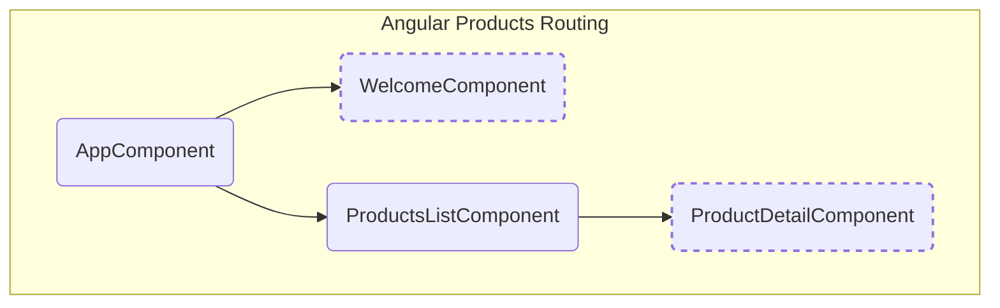
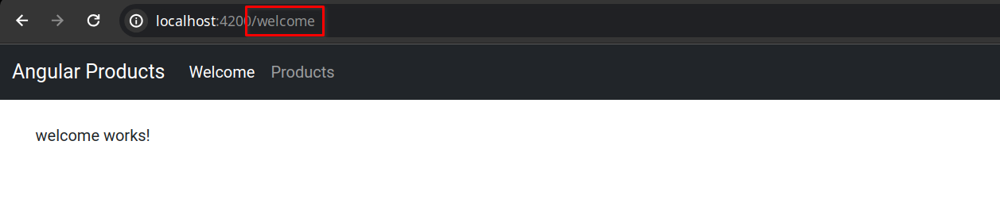
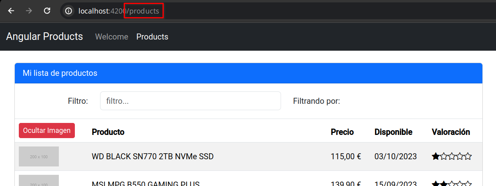
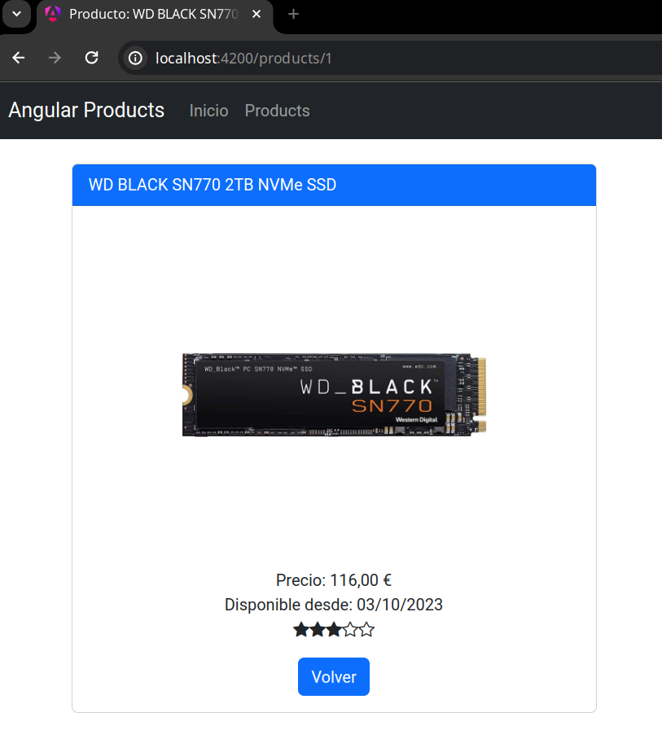

# UD6 - 5. Routing

## Configuración de las rutas

Como se explicó al principio, _Angular_ es un _framework_ para crear **SPA** (_Single Page Application_, o Aplicación de Una Página). Esto significa que **sólo se va a cargar el documento `index.html` en el navegador**, pero no significa que las aplicaciones no puedan estar divididas en **varias vistas** o **páginas**. La navegación entre las diferentes secciones o páginas de una aplicación se gestiona mediante _**Angular Router**_.

En la aplicación de ejemplo, se añadirán dos páginas más, además del listado de productos. Estas vistas serán una página de bienvenida (**`welcome`**) y otra para ver el detalle de un producto (**`product-detail`**).



Primero se crearán los componentes:

```bash
ng generate component welcome
ng generate component product-detail
```

En el archivo **`app.config.ts`**, por defecto ya estará añadido **`providerRouter`**, de lo contrario, se debe añadir:

```typescript title="app.config.ts" linenums="1" hl_lines="2-3 11"
import { ApplicationConfig } from '@angular/core';
import { provideRouter } from '@angular/router';
import { routes } from './app.routes';
import { provideAnimations } from '@angular/platform-browser/animations';
import { provideHttpClient, withInterceptors } from '@angular/common/http';
import { baseUrlInterceptor } from './interceptors/base-url.interceptor';

export const appConfig: ApplicationConfig = {
  providers: [
    provideHttpClient(withInterceptors([baseUrlInterceptor])),
    provideRouter(routes),
    provideAnimations(),
  ]
};
```

Se crearán las siguiente rutas:

- **`/welcome`**: Página de bienvenida, carga el componente `WelcomeComponent`
- **`/products`**: Página de listado de productos, carga el componente `ProductsListComponent`
- **`/products/:id`**: Página de detalle de un producto, carga el componente `ProductDetailComponent` añadiendo un parámetro, la `id` del producto a mostrar.
- La ruta por defecto, string vacío **`''`**, redirige a `/welcome`
- La ruta **`**`** cuando no coincida con ninguna ruta de las anteriores, redirige a `/welcome`, por lo general se muestra una página de **error 404**, página no encontrada, para la que se podría crear un componentes específico.

Las rutas de la aplicación se definen en el fichero **`app-rotes.ts`**:

```typescript title="app.routes.ts" linenums="1" hl_lines="3-5 8-12"
import { Routes } from '@angular/router';

import { WelcomeComponent } from './welcome/welcome.component';
import { ProductsListComponent } from './products-list/products-list.component';
import { ProductDetailComponent } from './product-detail/product-detail.component';

export const routes: Routes = [
  { path: 'welcome', component: WelcomeComponent },
  { path: 'products', component: ProductsListComponent },
  { path: 'products/:id', component: ProductDetailComponent},
  { path: '', redirectTo: '/welcome', pathMatch: 'full' },
  { path: '**', redirectTo: '/welcome', pathMatch: 'full' }
];
```

**El orden de las rutas es importante** porque el enrutador **tomará la primera coincidencia** al emparejar rutas, por lo que las rutas más específicas deben colocarse encima de las rutas menos específicas. La ruta comodín `**` es la última porque coincide con todas las URL, y el enrutador la selecciona sólo si ninguna otra ruta coincide primero.

Ahora falta **activar el _router_ en la plantilla HTML**. Para indicar **dónde se debe cargar el contenido de cada ruta**, el componente asociado a la misma. Para ello creamos un elemento llamado **`<router-outlet>`** en la plantilla principal `AppComponent`. Dentro, se cargará un contenido u otro en función de la ruta actual, permaneciendo estático el resto de elementos en esa plantilla.

Los enlaces para navegar a las diferentes rutas, en lugar de utilizar _`href`_, utilizarán la directiva de _Angular_ **`routerLink`**. El valor será un array con los componentes de la ruta.

```html title="app.component.html" linenums="1" hl_lines="4 8-10 16-19 27"
<nav class="navbar navbar-expand navbar-dark bg-dark mb-4">
  <div class="container-fluid">
    <a class="navbar-brand"
       routerLink="/welcome">{{title}}</a>
    <ul class="navbar-nav me-auto">
      <li class="nav-item">
        <a class="nav-link"
           routerLink="/welcome"
           routerLinkActive="active"
           ariaCurrentWhenActive="page">
          Inicio
        </a>
      </li>
      <li class="nav-item">
        <a class="nav-link"
           routerLink="/products"
           routerLinkActive="active"
           ariaCurrentWhenActive="page"
           [routerLinkActiveOptions]="{exact: true}">
          Products
        </a>
      </li>
    </ul>
  </div>
</nav>
<div class="container">
  <router-outlet></router-outlet>
</div>
```

Para que funcione correctamente, hay que importar las directivas de `@angular/route`: `RouterLink` y `RouterOutlet` que ya estarán importadas al crear el proyecto, y **`RouterLinkActive`** que se debe incluir manualmente, en el componente principal de la aplicación, **`AppComponent`** (`app.component.ts`):

```typescript title="app.module.ts" linenums="1" hl_lines="5 13"
import { Component } from '@angular/core';
import { CommonModule } from '@angular/common';
import {
  RouterLink, RouterOutlet,
  RouterLinkActive,
} from '@angular/router';

@Component({
  selector: 'app-root',
  standalone: true,
  imports: [
    CommonModule, RouterOutlet, RouterLink,
    RouterLinkActive
  ],
  templateUrl: './app.component.html',
  styleUrl: './app.component.css'
})
export class AppComponent {
  title = 'Angular Products';
}
```

La directiva **`routerLinkActive`** se utiliza para **asignar una o varias clases CSS** al enlace **cuando la ruta está activa**. En este caso la clase `active` de _Bootstrap_.

La directiva **`[routerLinkActiveOptions]`** con el objeto **`{exact: true}`** se usa en combinación con `routerLinkActive`. Por defecto un enlace está activo cuando su ruta coincide o es un prefijo de la actual, por ejemplo, en enlace a `/products` está activo cuando se encuentra en `/products/23`, que es otra página, con el detalle del producto. Con esta opción **sólo se considera activo cuando la ruta es exacta**.




## Cambiar el título la página

El título de la página está definido en `index.html`, dentro de la sección `<head>`. _Angular_ sólo tiene control sobre lo que pasa dentro de la etiqueta `<app-root>`, el componente principal de la aplicación. Por ello no se puede usar interpolación para establecer el título de la sección actual `<title>{{title}}</title>`.

Para solucionar el problema, se pueden configurar los títulos de cada ruta en **`app.routes.ts`** mediante la propiedad **`title`**. Por ejemplo:

```typescript title="app.routes.ts" linenums="1" hl_lines="10 15 20"
import { Routes } from '@angular/router';
import { WelcomeComponent } from './welcome/welcome.component';
import { ProductsListComponent } from './products-list/products-list.component';
import { ProductDetailComponent } from './product-detail/product-detail.component';

export const routes: Routes = [
  {
    path: 'welcome',
    component: WelcomeComponent,
    title: 'Welcome'
  },
  {
    path: 'products',
    component: ProductsListComponent,
    title: 'Lista de productos'
  },
  {
    path: 'products/:id',
    component: ProductDetailComponent,
    title: 'Detalle del producto'
  },
  { path: '', redirectTo: '/welcome', pathMatch: 'full' },
  { path: '**', redirectTo: '/welcome', pathMatch: 'full' }
];
```

Otra forma de establecer el título es utilizar el servicio **`Title`** desde un componente. Se puede inyectar en el constructor y utilizar el método **`setTitle`** para establecer el título de la página.

```typescript title="product-detail.component.ts" linenums="1" hl_lines="2 13 16"
import { Component } from '@angular/core';
import { Title } from '@angular/platform-browser';

@Component({
  selector: 'app-welcome',
  standalone: true,
  imports: [],
  templateUrl: './welcome.component.html',
  styleUrl: './welcome.component.css'
})
export class WelcomeComponent {

  constructor(private title: Title) { }

  ngOnInit() {
    this.title.setTitle('Inicio');
  }
}
```

## Parámetros de ruta

En algunas páginas, como puede ser el detalle de un producto, se debe indicar qué producto cargar. La ruta definida en este caso es **`products/:id`**. Los elementos de la URL precedidos de **`:`** son parámetros que recibe la ruta. Por ejemplo, para cargar el producto con `id = 4` se indica con la ruta `/products/4`.

Para pasar la `id` del producto en la ruta, se establece como enlace en la descripción del producto:

```typescript title="product-item.component.html" linenums="1" hl_lines="5"
<td></td>
<td>
  <a [routerLink]="['/products', product.id]">
    {{product.description}}
  </a>
</td>
<td>{{product.price | currency:'EUR':'symbol'}}</td>
<td>{{product.available | date:'dd/MM/y'}}</td>
<td>
  <app-star-rating [rating]="product.rating"
                   (ratingChanged)="changeRating($event)" />
</td>
```

El enlace se define con la directiva **`routerLink`** y un _array_ con los elementos de la ruta. En este caso, el primer elemento es `/products` y el segundo es la `id` del producto.

Para que funcione se debe **importar `RouterLink`** en el componente:

```typescript title="product-item.component.ts" hl_lines="2 8"
...
import { RouterLink } from '@angular/router';

@Component({
  ...
  imports: [
    ...
    RouterLink
  ],
  ...
})
export class ProductItemComponent {
    ...
```

Ahora se debe recoger dicho parámetro en el componente que gestiona la ruta **`ProductDetailComponent`**. Para ello se inyecta el servicio **`ActivatedRoute`**.

```typescript title="product-detail.component.ts" linenums="1" hl_lines="3-4 23-25 31 37 55"
import { Component } from '@angular/core';
import { CommonModule } from '@angular/common';
import { ActivatedRoute, Router } from '@angular/router';
import { Title } from '@angular/platform-browser';
import { Product } from '../interfaces/product';
import { ProductService } from '../services/product.service';
import { StarRatingComponent } from '../star-rating/star-rating.component';

@Component({
  selector: 'app-product-detail',
  standalone: true,
  imports: [
    CommonModule,
    StarRatingComponent
  ],
  templateUrl: './product-detail.component.html',
  styleUrl: './product-detail.component.css'
})
export class ProductDetailComponent {
  product!: Product;

  constructor(
    private router: Router,
    private route: ActivatedRoute,
    private title: Title,
    private productService: ProductService
  ) { }

  ngOnInit() {
    // obtiene el id del producto de la ruta
    const id = this.route.snapshot.params['id'];

    this.productService.getProduct(id).subscribe({
      next: prod => {
        this.product = prod;
        // establece el título de la página
        this.title.setTitle(`Producto: ${this.product.description}`);
      },
      error: err => console.error(err)
    });
  }

  changeRating(rating: number) {
    if (this.product.id) {
      this.productService.updateRating(this.product.id, rating)
        .subscribe({
          next: prod => this.product = prod,
          error: err => console.error(err)
        });
    }
  }

  goBack() {
    // vuelve al listado de productos
    this.router.navigate(['/products']);
  }
}
```

El servicio **`ActivatedRoute` contiene información sobre la ruta actual**, sus parámetros y otros datos asociados con la ruta. **`snapshot`** devuelve una instantánea de la ruta actual que contiene información sobre los parámetros, incluido el parámetro `id` definido en la ruta.

La plantilla HTML para mostrar el detalle del producto es la siguiente:

```html title="product-detail.component.html" linenums="1"
<div class="card">
  <div class="card-header bg-primary text-white">
    {{ product.description }}
  </div>
  <div class="card-block p-3 text-center">
    
    <div>Precio: {{ product.price | currency:'EUR':'symbol' }}</div>
    <div>Disponible desde: {{ product.available | date:'dd/MM/y' }}</div>
    <div>
      <app-star-rating [rating]="product.rating"
                       (ratingChanged)="changeRating($event)" />
    </div>
    <div class="mt-3">
      <button type="button"
              class="btn btn-primary"
              (click)="goBack()">
        Volver
      </button>
    </div>
  </div>
</div>
```

Se ha creado la clase CSS **`product-image`** para que la imagen del producto no se muestre a tamaño completo:

```css title="product-detail.component.css"
.product-image {
    width: 300px;
    max-height: 300px;
    margin: 20px auto;
    display: block;
    object-fit: contain;
}
```



### Mostrar datos asíncronos

Al navegar a la página de detalle de un producto, primero debe obtener sus los datos del servidor. Esto es una operación asíncrona, por lo que hasta que el servicio no devuelva los datos, el valor del producto será `undefined`. Si en este estado, _Angular_ intenta acceder a una propiedad para mostrarla, por ejemplo `product.description`, mostrará un error en consola.

Al igual que se puede inicializar un array vacío hasta obtener los datos, se puede crear un objeto con las propiedades vacías de forma temporal, y cuando se asignara el valor real, aparecerían los datos en la vista.

Otra opción, y muchas veces la mejor, es utilizar la directiva `@if`, y no mostrar la estructura hasta que el objeto tenga un valor válido.

```html
@if (product) {
    ...
}
```

Si es necesario mostrar la estructura sin los valores rellenos, se puede usar el operador opcional `?` después del nombre del objeto (ejemplo: `product?.description`). Esto indica a _Angular_ que sólo acceda a la propiedad cuando product tenga un objeto válido. Aún así no se puede evitar muchas veces usar `@if` en componentes que necesiten recibir el objeto o alguna propiedad del objeto (`star-rating` por ejemplo) para no crearlos hasta entonces.

### Navegación mediante código

Se ha añadido un botón "_Volver_" para regresar al listado en la página de detalle. En lugar de crear un enlace y usar `[routerLink]`, esta vez, se va a navegar a la ruta por código. Para ello, primero es necesario inyectar el servicio **`Router`** en el componente asociado:

```typescript title="product-detail.component.ts" hl_lines="2 7 12"
...
import { Router } from '@angular/router';
...
export class ProductDetailComponent {
  ...
  constructor(
    private router: Router,
    ...
  ) { }
  ...
  goBack() {
    this.router.navigate(['/products']);
  }
}
```

Activar una ruta por código es similar a usar un enlace. Se pasa al método `navigate` un array cuyo primer elemento es la ruta, y si necesitara parámetros extra, los se incluyen en dicho array.

## Permitir navegar a una ruta con `CanActivate`

En una aplicación _Angular_, se puede controlar si el usuario tiene permisos para acceder a una página, o abandonarla, usando **guards**. Son un tipo de servicio que se utilizan en combinación con el _router_. Por ejemplo, si se quiere impedir que un usuario que ha iniciado sesión acceda a la parte privada de la aplicación, se usará un tipo de guard llamado **`CanActivate`**.

Se va a crear un _guard_ de ejemplo que sólo dejará acceder al detalle de un producto si la `id` recibido es numérico. Para ello se crea con el siguiente comando:

```bash hl_lines="1 5"
ng generate guard guards/product-id

? Which type of guard would you like to create? (Press <space> to select, <a> to toggle all, <i> to invert selection, and 
<enter> to proceed)
❯◉ CanActivate
 ◯ CanActivateChild
 ◯ CanDeactivate
 ◯ CanMatch
```

Cuando pregunte, seleccionar la opción `CanActivate` (con el espacio se pueden marcar y desmarcar opciones).

En la implementación se comprobará si la `id` recibida es numérica, y devolverá `true` en ese caso o `false` en el contrario. También se puede devolver un objeto de tipo **`URLTree`** para redirigir a otra página.

```typescript title="product-id.guard.ts" linenums="1" hl_lines="6 9 13 16"
import { inject } from '@angular/core';
import { CanActivateFn, Router, UrlTree } from '@angular/router';

export const productIdGuard: CanActivateFn = (route, state) => {
  // obtiene el servicio Router
  const router = inject(Router);

  // obtiene el parámetro de ruta 'id'
  const id = route.params['id'];

  // si el id no es un número válido, redirige a la lista de productos
  if (isNaN(id) || id < 1) {
    return router.createUrlTree(['/products']);
  }

  return true;
};
```

En `router.createUrlTree(['/products'])` se indica como parámetro un _array_, que es la ruta a la se redirigirá, se pueden pasar parámetros añadiendo más elementos al _array_.

Para que funcione el _guard_ se debe añadir en la ruta correspondiente configurada en `app.routes.ts`:

```typescript title="app.routes.ts" hl_lines="5"
...
  {
    path: 'products/:id',
    component: ProductDetailComponent,
    canActivate: [productIdGuard],
    title: 'Detalle del producto'
  },
...
```

Para que funciona, se puede acceder a la ruta `http://localhost:4200/products/abc` y se redirigirá a `/products`.

## Permitir abandonar una ruta con `CanDeactivate`

El _guard_ **`CanDeactivate`** evita que un usuario pueda abandonar la ruta actual si no se cumplen ciertas condiciones. Por ejemplo, si el usuario está editando la información de un producto y no ha guardado los cambios, se puede utilizar este tipo de _guard_ para mostrarle un aviso para que confirme si quiere abandonar la página sin guardar los cambios.

Para el ejemplo, se va a crear un componente editar un producto, `product-edit`, y la ruta asociada `/product/edit/:id` → `ProductEditComponent`. Este componente contendrá un formulario para editar el producto seleccionado. Cuando el usuario intente abandonar la página aparecerá un mensaje de confirmación.

Se añade la nueva ruta en `app.routes.ts`:

```typescript title="app.routes.ts"
...
  {
    path: 'products/edit/:id',
    canActivate: [productIdGuard],
    component: ProductEditComponent,
    title: 'Modificando producto'
  },
...
```

Y se crea el nuevo componente `product-edit`:

```bash
ng generate component product-edit
```

```typescript title="product-edit.component.ts" linenums="1"
import { CommonModule } from '@angular/common';
import { Component, ViewChild } from '@angular/core';
import { FormsModule, NgForm } from '@angular/forms';
import { ActivatedRoute, Router, UrlTree } from '@angular/router';
import { Product } from '../interfaces/product';
import { ProductService } from '../services/product.service';

@Component({
  selector: 'app-product-edit',
  standalone: true,
  imports: [FormsModule, CommonModule],
  templateUrl: './product-edit.component.html',
  styleUrl: './product-edit.component.css'
})
export class ProductEditComponent {
  product?: Product;

  constructor(
    private router: Router,
    private route: ActivatedRoute,
    private productService: ProductService
  ) { }

  ngOnInit() {
    const id = this.route.snapshot.params['id'];
    this.productService.getProduct(id).subscribe({
      next: prod => this.product = prod,
      error: err => console.error(err)
    });
  }

  saveChanges() {
    if (this.product) {
      this.productService.updateProduct(this.product).subscribe({
        next: prod => {
          this.product = prod;
          this.router.navigate(['/products', this.product.id]);
        },
        error: err => console.error(err)
      });
    }
  }

  changeImage(fileInput: HTMLInputElement) {
    if (!this.product) { return; }
    if (!fileInput.files || fileInput.files.length === 0) return;

    const reader: FileReader = new FileReader();
    reader.readAsDataURL(fileInput.files[0]);
    reader.addEventListener('loadend', e => {
      this.product!.imageUrl = reader.result as string;
    });
  }
}
```

```html title="product-edit.component.html" linenums="1"
<div class="card">
  <div class="card-header bg-success text-white">
    Editar producto
  </div>
  <div class="card-body">
    @if(product) {
    <form #productForm="ngForm" (ngSubmit)="saveChanges()">
      <div class="mb-3 row">
        <label class="col-md-2 col-form-label text-md-end">Descripción</label>
        <div class="col-md-10">
          <input type="text"
                 class="form-control"
                 name="description"
                 [(ngModel)]="product!.description">
        </div>
      </div>
      <div class="mb-3 row">
        <label class="col-md-2 col-form-label text-md-end">Precio</label>
        <div class="col-md-10">
          <input type="number"
                 class="form-control"
                 name="price"
                 [(ngModel)]="product!.price">
        </div>
      </div>
      <div class=" mb-3 row">
        <label class="col-md-2 col-form-label text-md-end">Disponible</label>
        <div class="col-md-10">
          <input type="date"
                 class="form-control"
                 name="available"
                 [(ngModel)]="product!.available">
        </div>
      </div>
      <div class="mb-3 roe">
        <label for="image" class="form-label">Imagen</label>
        <input type="file"
               class="form-control"
               name="image"
               #fileImage
               (change)="changeImage(fileImage)">
      </div>
      @if(product.imageUrl) {
      
      }
      <div class="mb-3 row">
        <div class="offset-md-2 col-md-10">
          <button type="submit" class="btn btn-success">
            Guardar cambios
          </button>
        </div>
      </div>
    </form>
  }
  </div>
</div>
```

En la página de detalle de un producto **`product-detail`, se añade un botón**, a continuación del botón de "_volver_", que enviará a la página que acabamos de crear:

```html title="product-detail.component.html"
...
      <button type="button"
              class="btn btn-success ms-3"
              (click)="edit()">
        Editar producto
      </button>
...
```

```typescript title="product-detail.component.ts"
...
  edit() {
    if (this.product) {
      this.router.navigate(['products', 'edit', this.product.id]);
    }
  }
...
```

**Crear el _guard_ `leave-page`**, seleccionando la opción **`CanDeactivate`** en el comando `ng generate guard`:

```bash
ng generate guard guards/leave-page

? Which type of guard would you like to create? (Press <space> to select, <a> to toggle all, <i> to invert selection, and 
<enter> to proceed)
 ◯ CanActivate
 ◯ CanActivateChild
❯◉ CanDeactivate
 ◯ CanMatch
```

Esta interfaz necesita definir sobre qué componente va a actuar. Para que sea reutilizable se va a crear una interfaz genérica **`ComponentDeactivate`** que se va a implementarán los componentes que necesiten usar el _guard_.

```typescript title="product-edit.guard.ts" linenums="1"
import { CanDeactivateFn, UrlTree } from '@angular/router';
import { Observable } from 'rxjs';

export interface ComponentDeactivate {
  canDeactivate: () => boolean | UrlTree | Promise<boolean | UrlTree> | Observable<boolean | UrlTree>;
}

export const leavePageGuard: CanDeactivateFn<ComponentDeactivate> =
  (component, currentRoute, currentState, nextState) => {
    return component.canDeactivate ? component.canDeactivate() : true;
  };
```

Se debe indicar el uso del _guard_ en la ruta correspondiente:

```typescript title="app.routes.ts" hl_lines="5"
...
  {
    path: 'products/edit/:id',
    canActivate: [productIdGuard],
    canDeactivate: [leavePageGuard],
    component: ProductEditComponent,
    title: 'Modificando producto'
  },
...
```

Y se implementa en el componente **`ProductEditComponent`**:

```typescript title="product-edit.component.ts"
...
import { ComponentDeactivate } from '../guards/leave-page.guard';
...
export class ProductEditComponent implements ComponentDeactivate {
  ...
  canDeactivate(): boolean {
    return confirm('¿Quieres abandonar la página sin guardar los cambios?');
  }
}
```

Para simplificar el ejemplo, se ha usado el método `confirm` del objeto `window` para mostrar el mensaje de confirmación. En una aplicación real, la mejor opción es mostrar un **diálogo modal**.

Tampoco se comprueba si el usuario ha realizado cambios en el formulario, por lo que se mostrará el mensaje de confirmación siempre que se intente abandonar la página. _La validación de formularios se estudiará más adelante_.

## Obteniendo datos antes de activar una ruta con `Resolve`

A veces conviene obtener datos por adelantado, generalmente del servidor, antes de cargar una página. En lugar de obtener el producto a partir del `id` cuando se carga la página de `ProductDetailComponent`, se obtendrá antes de cargarla con un **_resolver_**. De esta forma, la página se cargará cuando esté disponible la información del producto, y se haya comprobado que se ha cargado de forma correcta.

```bash
ng generate resolver resolvers/product
```

El _resolver_ puede devolver cualquier tipo de dato directamente o dentro de una _Promesa_ u _Observable_, _Angular_ se suscribirá automáticamente para obtener el valor. También se pueden prevenir errores con `catchError` y actuar en consecuencia, por ejemplo, navegando a otra página.

Se va a modificar el _resolver_ recién creado cambiándole el tipo de dato con el que trabaja por `Product` → `ResolveFn<Product>`.

```typescript title="product.resolver.ts" linenums="1"
import { ResolveFn, Router } from '@angular/router';
import { inject } from '@angular/core';
import { EMPTY, catchError } from 'rxjs';
import { Product } from '../interfaces/product';
import { ProductService } from '../services/product.service';

export const productResolver: ResolveFn<Product> = (route, state) => {
  const router = inject(Router);
  const productsService = inject(ProductService);

  const id = route.params['id'];
  return productsService.getProduct(id).pipe(
    catchError(() => {
      router.navigate(['/products']);
      return EMPTY;
    })
  );  
};
```

Si ocurre algún error, redirigirá a la página de productos (esto también se podría controlar con un _guard_ de tipo `CanActivate` ya que se ejecuta después del `Resolve`). En caso contrario, devolvemos el producto obtenido por el servidor dentro del observable.

Se debe indicar el uso del _resolver_ en la ruta correspondiente:

```typescript title="app.routes.ts" hl_lines="6-8"
...
  {
    path: 'products/:id',
    canActivate: [productIdGuard],
    component: ProductDetailComponent,
    resolve: {
      product: productResolver
    },
    title: 'Detalle del producto'
  },
...
```

En la clase `ProductDetailComponent`, en lugar de llamar al servicio web para obtener el producto, se obtiene directamente de los datos de la ruta, ya que el `Resolve` lo ha precargado.

```typescript title="product-detail.component.ts" hl_lines="15"
...
import { ActivatedRoute, Router } from '@angular/router';
...
export class ProductDetailComponent {
  product!: Product;

  constructor(
    private router: Router,
    private route: ActivatedRoute,
    private title: Title,
    private productService: ProductService
  ) { }

  ngOnInit() {
    this.product = this.route.snapshot.data['product'];
    this.title.setTitle(`Producto: ${this.product.description}`);
  }
...
```

## Actividad 5

[Actividad 5](actividades/ud6-act5.md)
