# UD6 - 6. Formularios de plantilla

## Introducción

Los formularios suelen ser una de las partes más importantes de una aplicación web. Permiten crear y actualizar datos, identificar usuarios, etc. _Angular_ tiene una serie de características integradas para gestionar formularios, validarlos y facilitar la validación de errores y feedback al usuario.

Existen dos tipos de formularios en _Angular_:

- **Formularios de plantilla**. (_Template-driven forms_) Se basan en la vinculación de datos bidireccional mediante la directiva `ngModel`. Se usan para formularios sencillos.
- **Formularios reactivos**. (_Reactive forms_) Proporcionan acceso directo y explícito al modelo de objetos del formulario. En comparación con los formularios basados en plantillas, son más escalables, reutilizables y fáciles de testear.

En este apartado se describe cómo funcionan los formularios de plantilla. Para más información sobre los formularios reactivos, consultar la documentación oficial de _Angular_.

Para usar estas características, aunque simplemente sean directivas como `ngModel` para vincular datos del componente, necesitamos importar `FormsModule` en los componentes de la aplicación que vayan a requerirlo.

En el ejemplo, se va a modificar el formulario para modificar productos (ruta `products/edit/:id`), puesto que, hasta ahora no se están validando los datos introducidos por el usuario.

## ngModel

Se ha visto cómo funciona la directiva **`ngModel`** para vincular datos de un campo de entrada en dos direcciones. ([_UD6 - 2. Data binding. Pipes: Vinculación bidireccional [(ngModel)]_](../ud6-2-angular-databinding/#vinculacion-bidireccional-ngmodel)).

Se pueden utilizar atributos HTML5 de validación de campos como `required`, `min`, `max`, `pattern`, `minlength`, `maxlength`, etc. Estos atributos permiten la validación automática por parte de _Angular_ y asignan una serie de clases al elemento en cuestión, dependiendo de si es válido o no, si ha sido modificado, etc.

```html title="product-edit.component.html" hl_lines="6-8"
...
          <input type="text"
                 class="form-control"
                 name="description"
                 [(ngModel)]="product.description"
                 minlength="5"
                 maxlength="60"
                 required>
...
```

Al abrir el formulario, _Angular_ asigna las siguientes clases al campo de entrada:

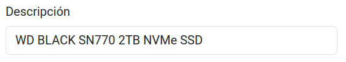

```html hl_lines="2"
<input _ngcontent-ng-c2895521065="" type="text" name="description" minlength="5" maxlength="60" required=""
class="form-control ng-untouched ng-pristine ng-valid"
ng-reflect-required="" ng-reflect-minlength="5" ng-reflect-maxlength="60" ng-reflect-name="description" ng-reflect-model="WD BLACK SN770 2TB NVMe SSD">
```

Si vaciamos el campo y lo dejamos en blanco, _Angular_ asigna las siguientes clases:

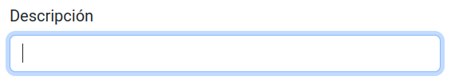

```html hl_lines="2"
<input _ngcontent-ng-c2895521065="" type="text" name="description" minlength="5" maxlength="60" required=""
class="form-control ng-dirty ng-invalid ng-touched"
ng-reflect-required="" ng-reflect-minlength="5" ng-reflect-maxlength="60" ng-reflect-name="description" ng-reflect-model="">
```

Clases asignadas según el estado del campo:

| Estado         | Clase (cierto) | Clase (falso)  |
| -------------- | -------------- | -------------- |
| **Visitado**   | `ng-touched`   | `ng-untouched` |
| **Modificado** | `ng-dirty`     | `ng-pristine`  |
| **Válido**     | `ng-valid`     | `ng-invalid`   |

Esto permite, entre otras cosas, asignar estilos mediante CSS a los elementos del formulario en función de su estado. Otra forma de interactuar con la validación es creando una referencia a la directiva `ngModel` (es un objeto). Esta referencia es un atributo cuyo nombre empieza por almohadilla ‘`#`’. A partir de esta referencia, podremos acceder a sus propiedades.

```html title="product-edit.component.html" hl_lines="9 11-14"
...
          <input type="text"
                 class="form-control"
                 name="description"
                 [(ngModel)]="product.description"
                 minlength="5"
                 maxlength="60"
                 required
                 #descModel="ngModel">

          <div>Dirty: {{descModel.dirty}}</div>
          <div>Valid: {{descModel.valid}}</div>
          <div>Value: {{descModel.value}}</div>
          <div>Errors: {{descModel.errors | json}}</div>
...
```

Valor válido, no modificado y sin errores:

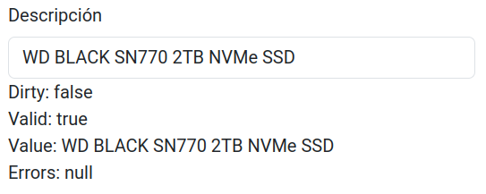

Valor longitud inválida, modificado y con errores:

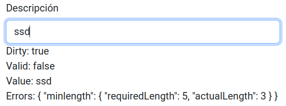

Valor requerido, modificado y con errores:

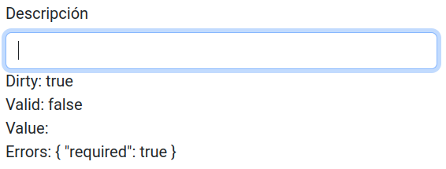

Con esto, se puedens usar las clases autoasignadas o la referencia creada para añadir estilo al formulario usando CSS, `ngClass`, `ngIf`, etc. _Ejemplo de Bootstrap_:

```html title="product-edit.component.html" hl_lines="10-11"
...
    <input type="text"
            class="form-control"
            name="description"
            [(ngModel)]="product.description"
            minlength="5"
            maxlength="60"
            required
            #descModel="ngModel"
            [ngClass]="{'is-valid': descModel.valid && descModel.touched,
                        'is-invalid': !descModel.valid && descModel.touched}">
...
```

Input con clase '`is-valid`' de _Bootstrap_

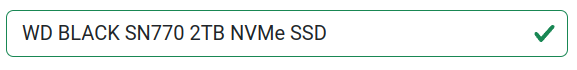

Input con clase '`is-invalid`' de _Bootstrap_:

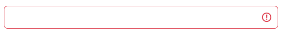

Por último, si fuera necesario procesar la entrada de datos del usuario detectando cuando cambia, se debe dividir la directiva bidireccional `[(ngModel)]`, en dos directivas unidireccionales separadas: `[ngModel]` y `(ngModelChange)`. Cuando se lanza el evento de cambio, `$event` representa el valor actual del campo. Ejemplo de transformación del texto de entrada a mayúsculas:

```html title="product-edit.component.html" hl_lines="5-6"
...
    <input type="text"
            class="form-control"
            name="description"
            [ngModel]="product.description"
            (ngModelChange)="product.description = $event.toUpperCase()"
            minlength="5"
            maxlength="60"
            required
            #descModel="ngModel"
            [ngClass]="{'is-valid': descModel.valid && descModel.touched,
                        'is-invalid': !descModel.valid && descModel.touched}">
...
```

## ngForm

La directiva `ngForm` está implícita en cualquier elemento `<form>`. Se puede crear una referencia igual que con `ngModel`, y así poder comprobar las propiedades generales del formulario, como si este es válido o ha sido modificado. **Un formulario sólo es válido si todos su campos lo son**. La propiedad `value`, es un **objeto _JSON_** que contiene los valores de todos sus campos.

```html title="product-edit.component.html"
<form #productForm="ngForm" novalidate
    (ngSubmit)="saveChanges()">
    ...
    <div>Touched: {{productForm.touched}}</div>
    <div>Valid: {{productForm.valid}}</div>
    <div>Value: {{productForm.value | json}}</div>
</form>
```

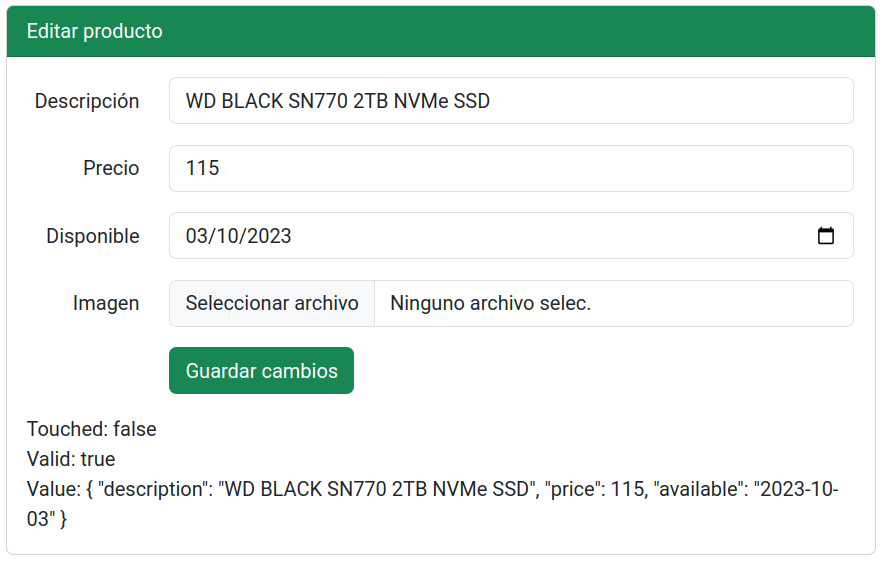

El atributo `novalidate` se recomienda para desactivar la validación integrada del navegador, dejando que esta sea controlada totalmente por _Angular_, con esto se consigue dar experiencia en cualquier navegador.

A través de esta referencia podemos acceder a los campos individuales (a partir de su atributo `name`). Esto ahorra tener que crear referencias para cada uno de ellos, aunque la sintaxis no es corta.

```html
<div>Descripción: {{productForm.control.get('description').value | json}}</div>
```

## Tipos de campo

Casi todos los `<input>` (`text`, `number`, `date`, `email`, etc.) funcionan de la misma manera. _Angular_ los valida según las reglas impuestas y usamos esta validación para cambiar el estilo de los campos.

```html title="product-edit.component.html" hl_lines="6 22 38"
...
      <div class="mb-3 row">
        <label for="description"
               class="col-md-2 col-form-label text-md-end">Descripción</label>
        <div class="col-md-10">
          <input type="text"
                 class="form-control"
                 id="description"
                 name="description"
                 [(ngModel)]="product.description"
                 minlength="5"
                 maxlength="60"
                 required
                 #descModel="ngModel"
                 [ngClass]="validClasses(descModel, 'is-valid', 'is-invalid')">
        </div>
      </div>
      <div class="mb-3 row">
        <label for="price"
               class="col-md-2 col-form-label text-md-end">Precio</label>
        <div class="col-md-10">
          <input type="number"
                 class="form-control"
                 id="price"
                 name="price"
                 [(ngModel)]="product.price"
                 min="0"
                 step="0.01"
                 required
                 #priceModel="ngModel"
                 [ngClass]="validClasses(priceModel, 'is-valid', 'is-invalid')">
        </div>
      </div>
      <div class="mb-3 row">
        <label for="available"
               class="col-md-2 col-form-label text-md-end">Disponible</label>
        <div class="col-md-10">
          <input type="datetime-local"
                 class="form-control"
                 name="available"
                 id="available"
                 [(ngModel)]="product.available"
                 required
                 #availModel="ngModel"
                 [ngClass]="validClasses(availModel, 'is-valid', 'is-invalid')">
        </div>
      </div>
...
```

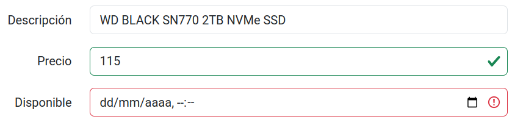

El campo `datetime-local` necesita una fecha en formato ligeramente diferente de como lo envía el servidor. En este caso, quitando la información relativa a milisegundos y la zona horaria (`.000Z`).

```typescript title="product-edit.component.ts" hl_lines="6-7"
...
  ngOnInit() {
    this.product = this.route.snapshot.data['product'];
    this.product!.available = this.product!.available.replace('.000Z', '');
  }
...
```

Además, para que el botón "_Guardar cambios_" se deshabilite cuando el formulario no sea válido se puede usar la propiedad `disabled`, que se actualiza automáticamente cuando el formulario cambia de estado.

```html title="product-edit.component.html" hl_lines="6"
...
      <div class="mb-3 row">
        <div class="offset-md-2 col-md-10">
          <button type="submit"
                  class="btn btn-success"
                  [disabled]="productForm.invalid">
            Guardar cambios
          </button>
        </div>
      </div>
...
```

Se crea un método llamado `validClasses` para reducir un poco el código a la hora de asignar las clases CSS de _Bootstrap_. Los parámetros son:

- referencia al ngModel
- clase cuando el elemento es válido
- clase cuando la validación falla

```typescript title="product-edit.component.ts"
...
  validClasses(ngModel: NgModel, validClass: string, errorClass: string) {
    return {
      [validClass]: ngModel.touched && ngModel.valid,
      [errorClass]: ngModel.touched && ngModel.invalid
    };
  }
...
```

En el caso de usar la directiva `ngModel` con un `checkbox`, el valor debe ser booleano (`true`: seleccionado, `false`: no seleccionado):

```html title="ejemplo de checkbox"
<div class="form-check">
    <label class="form-check-label">
        <input class="form-check-input" type="checkbox" name="check"
            [(ngModel)]="booleanProperty">
            Ejemplo checkbox
    </label>
</div>
```

Para crear un grupo de botones **radio**, se deben agrupar usando la misma propiedad en `ngModel`. Simplemente cambiando el valor:

```html title="ejemplo de radio buttons"
<div class="form-check">
    <label class="form-check-label">
    <input class="form-check-input" type="radio" name="radio" value="1"
        [(ngModel)]="someProperty">
        Opción 1
    </label>
</div>
<div class="form-check">
    <label class="form-check-label">
    <input class="form-check-input" type="radio" name="radio" value="2"
        [(ngModel)]="someProperty">
        Opción 2
    </label>
</div>
```

Por último, para vincular una lista desplegable `<select>` a una propiedad, se debe poner la directiva `ngModel` sólo dentro de dicho elemento `<select>` (nunca se le asignará a un elemento `<option>`).

## Validación

La validación de formularios es una parte importante de la experiencia de usuario. Los usuarios no deberían poder enviar datos inválidos y deberían **recibir _feedback_** sobre los errores cometidos.

Se pueden usar las propiedades de `ngModel` o las clases de validación automáticamente asignadas para asignar estilos o mostrar/ocultar ciertos errores.

En el ejemplo, se utiliza _Bootstrap_ como librería de estilos, dispone las clases "`valid-feedback`" o "`invalid-feedback`" que aparecen automáticamente cuando ponemos la clase "`is-valid`" o "`is-invalid`", respectivamente, al `input` de arriba.

```html title="product-edit.component.html" hl_lines="16-18"
...
      <div class="mb-3 row">
        <label for="description"
               class="col-md-2 col-form-label text-md-end">Descripción</label>
        <div class="col-md-10">
          <input type="text"
                 class="form-control"
                 id="description"
                 name="description"
                 [(ngModel)]="product.description"
                 minlength="5"
                 maxlength="60"
                 required
                 #descModel="ngModel"
                 [ngClass]="validClasses(descModel, 'is-valid', 'is-invalid')">
          <div class="invalid-feedback">
            La descripción debe tener entre 5 y 60 caracteres
          </div>
        </div>
      </div>
...
```

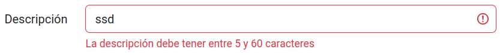

## Crear validadores personalizados

Es posible crear validadores personalizados que no existan en _Angular_. Para ello se debe generar una directiva que implemente la interfaz `Validator`. Esta tendrá un método llamado `validate` que recibirá la referencia al campo del formulario para validar. Para el ejemplo, se va a crear un validador para restringir la fecha mínima seleccionada. El valor a comparar, la fecha mínima, será recibido usando la directiva minDate con `@Input`.

```bash
ng g directive validators/min-date
```

```typescript title="min-date.directive.ts"
import { Directive, Input } from '@angular/core';
import { Validator, NG_VALIDATORS, AbstractControl, ValidationErrors } from '@angular/forms';

@Directive({
  selector: '[minDate]',
  standalone: true,
  providers: [{
    provide: NG_VALIDATORS, useExisting: MinDateDirective,
    multi: true
  }]
})
export class MinDateDirective implements Validator {
  @Input() minDate!: string;
  validate(control: AbstractControl): ValidationErrors | null {
    if (this.minDate && control.value && this.minDate > control.value) {
      return { minDate: true }; // Error returned
    }
    return null; // No errors
  }
}
```

Se debe añadir la directiva en el array de `providers` (`@Directive`) tal como se observa para registrarla como validador de formularios. Un validador devuelve `null` cuando todo está correcto y un objeto con una propiedad describiendo el error cuando algo falla.

Para aplicar el validador a un campo, se debe añadir el atributo `minDate` con la fecha mínima a comparar. En este caso, se va a usar una fecha concreta, pero se podría usar una propiedad del componente, por ejemplo, para que la fecha mínima sea la fecha actual.

```html title="product-edit.component.html" hl_lines="9 12-14"
...
        <div class="col-md-10">
          <input type="datetime-local"
                 class="form-control"
                 name="available"
                 id="available"
                 [(ngModel)]="product.available"
                 required
                 minDate="2023-01-01T00:00"
                 #availModel="ngModel"
                 [ngClass]="validClasses(availModel, 'is-valid', 'is-invalid')">
          <div class="invalid-feedback">
            La fecha debe ser posterior a 01/01/2023
          </div>
        </div>
...
```

Es necesario **importar la directiva** en el módulo del componente para poder usarla.

```typescript title="product-edit.component.ts" hl_lines="2 10"
...
import { MinDateDirective } from '../validators/min-date.directive';

@Component({
  selector: 'app-product-edit',
  standalone: true,
  imports: [
    FormsModule,
    CommonModule,
    MinDateDirective
  ],
  templateUrl: './product-edit.component.html',
  styleUrl: './product-edit.component.css'
})
export class ProductEditComponent implements ComponentDeactivate {
...
```

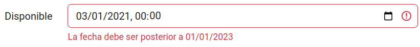

## Validar antes de enviar

Al enviar el formulario, se pueden terminar de validar ciertas cosas, procesar los datos a mandar, y llamar al correspondiente servicio.

Para acceder al objeto del formulario (`ngForm`) y comprobar su validación, se debe obtener una referencia de la plantilla usando el decorador `@ViewChild` y el nombre de la referencia.

```html title="product-edit.component.html"
...
    <form #productForm="ngForm"
          (ngSubmit)="saveChanges(productForm)"
          novalidate>
...
```

```typescript title="product-edit.component.ts" hl_lines="3 7"
...
export class ProductEditComponent implements ComponentDeactivate {
  ...
  saveChanges(productForm: NgForm) {
    if (this.product && productForm.valid) {
      this.productService.updateProduct(this.product).subscribe({
        next: prod => {
          this.product = prod;
          this.router.navigate(['/products', this.product.id]);
        },
        error: err => console.error(err)
      });
    }
  }
...
```


